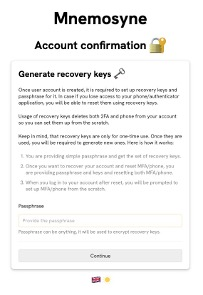

<h1 align="center">
    MNEMOSYNE
</h1>

# Table of Contents

1. [Introduction](#introduction)
2. [Existing Solutions](#existing-solutions)
3. [Infrastructure](#infrastructure)
4. [Technology Stack](#technology-stack)
    1. [Programming Languages and Platform](#programming-languages-and-platform)
    2. [Front-end Framework](#front-end-framework)
    3. [Back-end Framework](#back-end-framework)
    4. [Databases](#databases)
    5. [Cloud Technologies](#cloud-technologies)
    6. [Containerization](#containerization)
5. [Front-end](#front-end)
    1. [Components](#components)
    2. [Pages and Navigation](#pages-and-navigation)
    3. [Communication with Back-end](#communication-with-back-end)
    4. [Localization](#localization)
6. [Back-end](#back-end)
    1. [Modules](#modules)
    2. [DTO](#dto)
    3. [Middleware](#middleware)
    4. [Guards](#guards)
    5. [Decorators](#decorators)
7. [Databases Technologies](#databases-technologies)
    1. [ORM](#orm)
    2. [Database Models](#database-models)
    3. [Transactions and Databases Interceptors](#transactions-and-databases-interceptors)
8. [Concepts of Security Measures](#concepts-of-security-measures)
    1. [Authentication](#authentication)
    2. [Authorization](#authorization)
    3. [Account Recovery Keys](#account-recovery-keys)
    4. [Logs](#logs)
    5. [User Input Data Validation](#user-input-data-validation)
    6. [Error Handling](#error-handling)
9. [Implementation of security measures](#implementation-of-security-measures)
    1. [Security Measures on Front-end](#security-measures-on-front-end)
        1. [Validation of User Input on Front-end](#validation-of-user-input-on-front-end)
        2. [User Authentication on Front-end](#user-authentication-on-front-end)
        3. [Multi-Factor Authentication on Front-end](#multi-factor-authentication-on-front-end)
        4. [Account Recovery Keys on Front-end](#account-recovery-keys-on-front-end)
        5. [Error Handling on Front-end](#error-handling-on-front-end)
    2. [Security Measures on Back-end](#security-measures-on-back-end)
        1. [Validation of User Input on Back-end](#validation-of-user-input-on-back-end)
        2. [User Authentication on Back-end](#user-authentication-on-back-end)
        3. [Multi-Factor Authentication on Back-end](#multi-factor-authentication-on-back-end)
        4. [Account Recovery Keys on Back-end](#account-recovery-keys-on-back-end)
        5. [Error Handling on Back-end](#error-handling-on-back-end)
        6. [User Access on Back-end](#user-access-on-back-end)
    3. [Proxy Server](#proxy-server)
        1. [Protection of Cookies](#protection-of-cookies)
        2. [Authentication of API](#authentication-of-api)
        3. [Saving Logs](#saving-logs)
        4. [Error Handling on Proxy Server](#error-handling-on-proxy-server)
    4. [Implementation of Security Measures for Intrastructure](#implementation-of-security-measures-for-intrastructure)
        1. [AWS IAM](#aws-iam)
        2. [AWS S3](#aws-s3)
        3. [AWS EC2](#aws-ec2)
        4. [AWS RDS](#aws-rds)
        5. [Nginx Web Server and TLS/SSL](#nginx-web-server-and-tlsssl)
        6. [DNS and e-mail infrastructure](#dns-and-e-mail-infrastructure)
10. [Application Deployment](#application-deployment)
    1. [Version Control System](#version-control-system)
    2. [CI/CD](#cicd)
    3. [GitHub Actions](#github-actions)
11. [Tests of Application](#tests-of-application)
    1. [Unit and integration testing using Jest](#unit-and-integration-testing-using-jest)
    2. [Automatic testing during application deployment](#automatic-testing-during-application-deployment)
12. [Documentation](#documentation)
    1. [OpenAPI](#openapi)
    2. [Swagger](#swagger)
    3. [Views of Application](#views-of-application)
13. [Last Word](#last-word)
14. [Annexes](#annexes)

# Introduction

In the dynamic landscape of modern commerce, the proliferation of online marketplaces heralds a paradigm shift in the way goods and services are exchanged in the digital sphere. As technological advances continue to transform the global marketplace, traditional trading models are increasingly giving way to innovative online platforms that offer unparalleled convenience, accessibility and efficiency. The development of online marketplaces represents a fundamental shift from traditional retailing, democratizing access to markets and providing both consumers and sellers with new opportunities to engage and trade. Unlike traditional retail channels, which are often limited by geographic restrictions and physical infrastructure, online marketplaces overcome such barriers by providing a virtual marketplace where buyers and sellers from around the world can easily connect and transact. 

The main goal of this project is to harness the transformative potential of the online marketplace by implementing a dynamic platform that facilitates the seamless exchange of goods and services in the digital sphere. Leveraging technological innovations and best practices in e-commerce, the goal of this work is to create a marketplace platform that would allow both businesses and end-users to sell and purchase a variety of goods and services, enabling users to enhance trading opportunities and redefine the parameters of engagement in today's market landscape.

# Existing Solutions

There are already a multitude of solutions on the market, each offering unique features and functionality tailored to the diverse needs of consumers and sellers. One such prominent example is Amazon, which is one of the largest online marketplaces and has revolutionized the way people shop online. With its premier product catalog, intuitive user interface, and efficient fulfillment infrastructure, Amazon has set the benchmark for online marketplaces, facilitating millions of transactions daily across countless product categories. From electronics and clothing to home goods and digital services, the Amazon marketplace ecosystem offers unparalleled convenience and choice to consumers around the world. It is also worth noting that Amazon also works as a SaaS service, as it allows companies to save time, money and resources to create their own website and all the necessary infrastructure to move or expand their business to the online sphere. (Fig. 1)

|  |
|:--:|
| *Fig. 1. Amazon. Source: https://amazon.com* |

A solution similar to Amazon is eBay. eBay is a testament to the power of peer-to-peer commerce, allowing individuals to buy and sell a wide range of products in an auction format. Through its seller tools, payment mechanisms and buyer protection policies, eBay has developed a thriving community of sellers and buyers, supporting a marketplace where unique and niche items find eager buyers. Additionally, the integration of eBay's advanced search algorithms and recommendation engine provides users with the ability to discover relevant offers tailored to their preferences, improving the overall shopping experience (Fig. 2).

|  |
|:--:|
| *Fig. 2. eBay. Source: https://ebay.com* |

While Amazon and Ebay are global marketplaces, there are also solutions targeting local, location-based markets. A perfect example of such a local market is olx.pl. At its core, OLX inherits the philosophy of the marketplaces mentioned above, being a place for buyers and sellers, both end users and companies, to communicate. Unlike Amazon and eBay, OLX cannot boast of such a large number of products due to geographical restrictions, as well as a large number of product and service categories. However, its advantage is a much less busy and nicer interface (Fig. 3).

|  |
|:--:|
| *Fig. 3. OLX. Source: https://olx.pl* |

In their business models, all 3 makretplaces presented above provide the same business solution for end-users and companies - they provide a platform that is used to buy and sell goods and services. The difference between them lies in the geographical markets in which they operate (eBay and Amazon operate globally, while olx.pl provides its services only in Poland), as well as in product categories and the approach to product search. Talking about the goals of this work, the goal is to implement a business model that is used on all 3 platforms, namely to create a platform for the purchase and sale of various goods and services available to both end-users and companies.

# Infrastructure

When talking about application implementation, first of all, you should start with the architecture of all systems, as well as the interactions with each other. The architecture stage involves designing the overall structure and organization of the application, including key decisions about the technology stack, data modeling, system components, and overall system behavior. The entire infrastructure, its key components and components used are shown in the diagram below (Fig. 4).

|  |
|:--:|
| *Fig. 4. Infrastructure of all elements in the application. Source: own work* |

The entire application will run on AWS virtual infrastructure. The application will consist of three separate subsystems that run on three separate virtual machines - the client part, the proxy server, and the server part. All of this will run using AWS EC2 remote computing resources (virtual computers). AWS S3 will be used to store static data such as icons and images. The AWS RDS service and a database based on the PostgreSQL engine will be used as the main database. Each of the resources in the AWS ecosystem will use special resources to ensure its own security - security groups, and they will all be connected into a special AWS VPC network - a virtual private cloud that allows you to simulate the behavior if these servers were directly connected to each other in this the network itself.

As additional elements of the entire infrastructure, the MongoDB database will also be used to save and store all logs from the server and Cloudflare, which will be used to create a DNS infrastructure to manage the domain name, provide an additional level of security, as well as to create an e-mail system.

# Technology Stack

Choosing the right set of technologies is one of the most important elements of creating a web application, which is discussed at the design stage. The right choice of technology stack, dictated by the current market situation, will have the greatest impact on how its development will proceed, what programming teams will have to be involved in the development of this application, and how stable and secure the application will be.

## Programming Languages and Platform

The main programming language of the entire project will be JavaScript, or more precisely, its add-on providing access to strictly typed data - TypeScript. This programming language is used to create both front-end and back-end. Using TypeScript in both front-end and back-end development offers several benefits that contribute to a more reliable and maintainable project:

1. One of the main advantages of TypeScript is static typing. Allows developers to define variable types, function parameters, and return types. This helps catch type errors at compile time rather than run time, leading to more robust and maintainable code.
2. Static typing helps identify and fix errors early in the development process, leading to improved code quality. This greatly reduces the likelihood of runtime errors caused by type mismatches.
3. TypeScript is perfect for large-scale applications. The ability to define and enforce types helps manage the complexity of large code bases, reducing the risk of errors and making it easier to scale applications.
4. TypeScript has a rich ecosystem of tools and libraries that work well with it. This includes popular build tools, test frameworks, and other development tools that use the TypeScript type system to streamline development workflows.

Initially, JavaScript was only used to create dynamic pages on the client side and was in no way intended to work on the server side, however, it can be noted that in this project this programming language is used not only on the client side of the page, but also on the side server. To achieve this goal, a technology called NodeJS is used - it is an open-source runtime environment that allows JavaScript code to be run on the server. This means that it is possible to use the same programming language on both the client and server sides of web applications. This can simplify programming and improve code sharing between two environments.

## Front-end Framework

Front–end refers to the client side of a web application, which is the part of the application that users interact with directly. It covers everything that users experience visually and interactively in their web browsers. Writing the client part involves creating and implementing the user interface (UI) and user experience (UX) of a website or web application.

In order to simplify the creation of the client part by the programmer, various frameworks are used which, by using a high level of abstraction and providing the programmer with only a specific set of rules for creating a web application, can significantly speed up the creation of the process application and significantly reduce the number of errors when writing it. To create the client part of this project, a framework called Angular was chosen.

Angular is a framework developed by Google. It offers a robust and comprehensive front-end development platform that excels in building dynamic and scalable web applications. Its modular architecture makes code organization and maintenance easier, increasing productivity.

## Back-end Framework

The back-end (or API - Application Programming Interface), which is the server part of the entire application, is responsible for processing requests from the user and sending responses to the client part. The back-end is also responsible for the entire business logic of the application.

The back-end interface itself was designed based on the REST architecture - REST (Representational State Transfer) is an architectural approach used to design web applications and Internet services. It promotes the use of a stateless client-server communication model, in which each request from the client to the server must contain all the information needed to understand and process it. REST also relies on a uniform and consistent interface, typically using standard HTTP methods such as GET, POST, PUT, and DELETE to interact with resources. This approach simplifies communication and increases the scalability and maintainability of web-based systems.

REST works based on the so-called resources (or endpoint). Resources are the underlying abstractions that an API exposes and manipulates. These resources can represent a wide range of things, including data objects, services, or concepts, and are identified by a unique Uniform Resource Identifier (URI), usually a URL. Resources are combined into logical connections using the so-called controllers. This is a specialized class responsible for managing the processing of incoming HTTP requests in the application.
For example, a controller called auth. As the name of this controller suggests, it is responsible for all user authentication operations. Below is a list of some of the resources found in this controller along with their HTTP methods and a short description:

1. `POST /auth/registration` – responsible for creating a new account for the user.
2. `POST /auth/login` – responsible for user authentication.
3. `GET /auth/refresh` – responsible for updating user authorization tokens.

This approach allows you to easily segregate the functionality of the entire application, especially when simplicity, scalability and cross-platform compatibility are the basic requirements. A framework called NestJS was chosen to implement the server part of the entire application. This framework runs on TypeScript as a programming language and on NodeJS, which, as mentioned above, is a platform that enables JavaScript to run on the server side. Thanks to its modular structure, NestJS enables the creation of robust and easy-to-maintain server-side applications. The use of decorators similar to Angular in the framework increases the readability of the code and promotes efficient development. Using NestJS makes it easy to create RESTful APIs and microservices, providing a solid foundation for building efficient and extensible back-end systems.

## Databases

A database is a structured and organized set of data that is intended to be easily accessible, managed and updated. It serves as a repository for storing, retrieving and manipulating data in a systematic and efficient manner. Databases are fundamental components across a variety of domains, providing a structured mechanism for organizing and storing information for a variety of applications, including business operations, scientific research, and especially web development.

In the context of web development, databases play a key role in managing and persistently storing the data that powers dynamic websites and web applications. Website developers use databases to store information such as user profiles, product details, content, and more. The two basic types of databases used in website development and that were used in this project are relational databases, e.g. PostgreSQL, which is the main database in the project, and NoSQL databases, e.g. .MongoDB. Relational databases use structured tables with predefined relationships between them, while NoSQL databases offer a more flexible and schema-free approach that accommodates unstructured or semi-structured data.

## Cloud Technologies

Various cloud services are used to implement the application and make it available to the end user via the Internet. Cloud services provide a virtualized environment that eliminates the complexity associated with hardware provisioning and maintenance. In simple terms, this approach allows you to rent computing resources provided by the supplier. This approach is called IaaS (Infrastructure as a Service). Infrastructure as a Service (IaaS) is a cloud computing model that provides virtualized computing resources over the Internet. In the IaaS model, instead of investing in and maintaining physical hardware, users can rent virtualized computing resources such as virtual machines, storage, and networking components from a cloud service provider. This approach enables companies and individuals to dynamically scale their infrastructure without having to make significant upfront investments in hardware.

In an IaaS environment, users have control over operating systems, applications, and development platforms, allowing for greater flexibility and customization compared to other cloud service models. This flexibility makes IaaS well suited to a variety of applications, including hosting and running applications, development and test environments, and data storage. Key features of infrastructure as a service include on-demand provisioning, self-service capabilities, and a pay-as-you-go pricing model that charges users based on how they actually use resources. Popular examples of IaaS providers include Amazon Web Services (AWS), Microsoft Azure, and Google Cloud Platform (GCP). Cloud resources from Amazon Web Services were used to create the infrastructure for this application. The resources they provided were used for every element of the application's infrastructure, including the server itself on which the application runs, the database server, and elements for storing static files such as icons and images.

An important point is that AWS only served as a provider of computing resources, other services were also used for other purposes. For example, Cloudflare was used as a service to manage the application domain name. This applies not only to the web server and the URL that the user enters in the address bar of his browser, but also to creating the necessary infrastructure for sending e-mails to users using the domain name.

## Containerization

Containerization in web software development is an approach that encapsulates applications and their dependencies into lightweight, portable units called containers. At its core, containerization is about connecting an application with its runtime environment, libraries, and other necessary components, ensuring consistency and eliminating environmental discrepancies between different stages of the software lifecycle. Docker, a widely adopted containerization platform, played a key role in this methodology and it was this technology that was used in this project to implement containerization. It is worth adding that in this project Docker containers were used only when writing the application code, because their use facilitates the management of all application subsystems.

It is designed in such a way that using one script located in the main project folder, three containers are launched simultaneously and are connected to one network, which also allows them to interact with each other. This system was implemented using a special tool called Docker Compose. This technology allows you to describe and run several containers at the same time using specially described files in the YAML format, as well as connect them into one network if communication between them is required. Thus, Docker's containerization technology allows you to save a lot of time and resources when writing code, and also greatly simplifies the process of managing all application subsystems.

# Front-end

The front-end, also called the client part, is a key element of the web application, serving as a user interface and facilitating user interaction with the base system. It includes the presentation layer responsible for rendering the visual elements that users perceive and interact with in their browsers. The primary goal of the front-end is to provide a smooth and engaging user experience by ensuring effective content display, responsiveness to user actions, and presentation of dynamic data.

Key front-end components include HTML (Hypertext Markup Language), which defines the structure and layout of web pages, CSS (Cascading Style Sheets), which governs the style and visual presentation of these pages, and JavaScript, the programming language that enables features dynamic and interactive. These technologies work together to create visually appealing, responsive and user-friendly interfaces.

## Components

One of the biggest advantages of the Angular framework is the ability to create your own components of any complexity. It can either be a component responsible for receiving data from the user or a component that acts as a page layout. Creating your own components not only simplifies code writing by increasing the repeatability of using different components, but also allows you to maintain the style and functionality of all components at once, since you only need to change the code in one place in the component.

For a more visual example, an input field component that is used to receive input from the user will be presented below, and the principles of its operation will be described. A ready-made component is used directly on the page itself, which is a regular HTML tag:

```html
<basic-input
  [label]="t('input.companyName')"
  [placeholder]="t('input.provideCompanyName')"
  [inputDescription]="t('input.companyDesc')"
  [errorMessage]="t('input.companyError')"
  [value]="companyName"
  [minLength]="2"
  [maxLength]="64"
  (valueChange)="companyName = $event"
  (incorrectInput)="incorrectCompanyName = $event"
/>
```

The attributes used by this tag are custom attributes used for so-called bindings. These bindings (or directives) come in 2 different types: property binding and event binding.

1. Property binding is a one-way data binding between a component and a property of the target. Used to set the target's property to the value of the component's property. As can be seen from the component example presented above, an example of such a connection may be a `label`. This basically means that a value is unilaterally passed to a component that is already being used by it. In the component itself, such bindings are indicated by the `@Input` decorator and the value is passed in square brackets.
2. Event binding is a one-way data binding from the target to the component. It is used to respond to events such as button clicks, mouse events, etc. At its core, this type of connection is a function that can capture something from a child component to its parent. In the component, such bindings are marked with the `@Output` decorator and are used with round brackets. Returning to the input component example, what the user types into these input fields is returned via the valueChange directive and through a special event variable ($event) that contains the value of the user's input field, writes it to a variable on this page called companyName.

Turning to the source code of the component itself, all directives, including property bindings and event bindings, of this component are marked with decorators depending on their type. Some of them allow you to add field names (`label`, `placeholder`), specify under what conditions this field should not be available to the user (`disabled`), when an error should appear and under what conditions (`showError`, `errorMessage`). Simplifying what has already been written above about property bindings, and also looking at the name of the decorator that is used for this, we can say that property binding directives are used as input to the component.

```typescript
@Input() label: string;
@Input() type = 'text';
@Input() placeholder: string;
@Input() value: string;
@Input() disabled = false;
@Input() showError = false;
@Input() errorMessage: string | null;
@Input() inputDescription: string | null;
@Input() minLength: number;
@Input() maxLength: number;
@Input() readOnly = false;
@Input() onWhite = false;
@Input() min: string;
@Input() max: string;
```

The other type of directives mentioned above were event linkages. From the name of the decorator used to create this field, you can tell that it serves as a function that returns something from the component to the parent component. This is done using so-called event emitters. An event generator is a class that takes as a generic type the data type that will be returned by this function. Using the `valueChange` event as an example, which responds to what the user enters, this event generator returns a string data type because everything the user enters is a string in the first place. This string, via the event variable (`$event`), is returned and can be processed in the parent component.

Since the data entered by the user may be of a special type (e.g. e-mail address or password), this component also includes logic for validating this data using regular expressions. If the user provides incorrect data that is not verified using these regular expressions, this information may also be returned using the `incorrectInput` and `passwordErrors` events. And already in the parent component, this data can be used, for example, to lock a button.

```typescript
@Output() valueChange = new EventEmitter<string>();
@Output() incorrectInput = new EventEmitter<boolean>();
@Output() passwordErrors = new EventEmitter<
  Array<{ error: boolean; text: string }>
>();
@Output() onSpace = new EventEmitter<boolean>();
```

Below is a screenshot (Fig. 5) from the registration page that clearly illustrates how the above directives, combined with HTML code, create a component that can be easily reused in different parts of the application.

|  |
|:--:|
| *Fig. 5. View of the component for entering data from the user on the registration page. Source: own work* |

This flexibility allows you to create components of any complexity, as well as create components that can be used for completely different scenarios in different places. Thanks to this approach, it also allows you to keep all the logic segregated without mixing it in different components, thus maintaining the cleanliness and quality of the code at the appropriate level. Using the user input field example, you can see very clearly that just changing the data type of the field to password allows the process of checking the password against all rules to be immediately implemented and, if something happens, show the user an invalid password error message .

## Pages and Navigation

When talking about pages and navigation in this application, it is important to mention that every object in Angular is a component in one way or another, including pages. Page components, in turn, are combined into modules that enable management of these components. This approach allows you to easily manipulate these components to create navigation of any complexity. For example, the following code is a module code that combines all pages in the application responsible for user authentication and clearly illustrates how to determine paths to these pages:

```typescript
const routes: Routes = [
  {
    path: 'account-confirmation/:hash',
    component: AccountConfirmationComponent
  }
];

@NgModule({
  declarations: [...components],
  imports: [
    RouterModule.forRoot(routes),
    CommonModule,
    ComponentsModule,
    NgOptimizedImage,
    LayoutsModule,
    TranslocoModule
  ],
  exports: [...components]
})
export class CredentialsModule {}
```

This module connects pages related to user authentication in the system, such as login, registration, password change and email address pages. In the code, such modules are declared using the `@NgModule` decorator, which accepts various parameters, including the module parameter with navigation - `RouterModule`. As the only parameter, this module accepts a list of objects, where each object is a component of the page, as well as the path to this page. As the only parameter, this module accepts a list of objects, where each object is a component of a page, as well as the path to this page. It is worth noting that the routing system also allows you to specify the names of dynamic parameters using the colon character. This approach can be very useful when it comes to implementing dynamic routing with multiple dynamically generated pages.

```typescript
ngOnInit() {
  this.translationService.setPageTitle(Titles.ACCOUNT_CONFIRMATION);

  this.route.paramMap.subscribe(async (params) => {
    const hash = params.get('hash');
    if (!hash) {
      await this.router.navigate(['login']);
    } else {
      this.hash = hash;
      this.confirmUserAccount(hash);
    }
  });
}
```

Such as in this case, where a randomly generated hash is used to confirm a user's account and is added to a link, and that link is emailed to the user. Then, when the user opens this link and navigates to the account confirmation page, which uses a special ngOnInit hook - a lifecycle hook that is called after Angular initializes all the directive's data-related properties, or in simpler terms, runs at that point , when a user visits a page and that page is initialized with data, from the URL, using the name that was used in the routing module, it is possible to retrieve this hash and start the user account confirmation process (Fig. 6).

|  |
|:--:|
| *Fig. 6. Example URL to the account confirmation page using a dynamic parameter. Source: own work* |

## Communication with Back-end

Talking about the infrastructure features of this application, communication between the server part and the client takes place through a proxy server. For this reason, the implementation of this communication on the client side has certain features. Mainly, this feature is that when sending a request to the API through a proxy server, you must pass not only the request content or parameters, but also the HTTP method, controller name and endpoint to which the request should be sent. Also, the service responsible for starting the page loading animation was used directly in the request sending function. This means that every time a request is sent to the server, the service will automatically start a loading animation, so there is no need to worry whether it is working every time a website sends a request to the server. Additionally, as soon as the server receives a response, the animation will automatically turn off or, if the server's response was incorrect, an error message will be displayed to the user.

```typescript
apiProxyRequest({ controller, action, method, payload, params }: ProxyRequestInterface): Observable<any> {
  const requestUrl = `${this.frontProxyUrl}/${controller}/${action}`;
  const requestBody: {
    method: Method;
    params?: object;
    payload?: object;
  } = { method };
  const headers: { [key: string]: string } = {};

  if (params) requestBody.params = params;
  if (payload) requestBody.payload = payload;

  const request$ = this.http.post<any>(requestUrl, requestBody, {
    withCredentials: true,
    headers
  });

  this.loaderService.start();

  return request$.pipe(
    catchError(async (error) => {
      await this.errorHandler.errorHandler(error);
      throw error;
    }),
    finalize(() => {
      this.loaderService.stop();
    })
  );
}
```

According to the controllers available on the back-end, the appropriate services were recreated on the client side. However, they all use the above code to send requests. Below is an example code from the service responsible for all user authentication processes. As the name suggests, this function is responsible for user registration.

```typescript
registration(
  payload: RegistrationPayload
): Observable<{ message: RegistrationResponse }> {
  const language = localStorage.getItem('translocoLang');

  if (language) payload.language = language;

  return this.apiService.apiProxyRequest({
    method: Method.POST,
    controller: Controller.AUTH,
    action: AuthEndpoint.REGISTRATION,
    payload
  });
}
```

In addition to the payload variable directly containing the user data used during registration, a function that will send a request to the API via a proxy must also pass the method that this endpoint uses, along with the name of the controller and the name of the endpoint itself.

## Localization

Localization in web applications refers to the process of customizing the content, interface, and functionality of an application to meet the linguistic, cultural, and regional preferences of the target audience. This includes translating text elements, adapting date and time formats, and incorporating cultural nuances to enhance user experience and ensure effective communication in diverse global markets. The goal of localization is to create a consistent and culturally appropriate user interface, thereby promoting user engagement and acceptance across regions and linguistic communities. In this particular project, localization was carried out only at the level of translating the text of the interface elements into three languages ​​- Polish, English and Russian. The localization itself was implemented using a package called Transloco Angular.

This library allows you to translate text at runtime, without having to completely rebuild your application to apply the changes. The principle of operation is that a special class is created in the code to perform translation functions. This class describes what languages ​​will be used to translate text in the application, as well as other options, such as whether the page will automatically reload if the user changes the language. Based on the `@NgModule` decorator, we can say that this class is an Angular module and to connect it, just import it into the main module of the entire application.

```typescript
@NgModule({
  exports: [TranslocoModule],
  imports: [
    TranslocoPersistLangModule.forRoot({
      storage: {
        provide: TRANSLOCO_PERSIST_LANG_STORAGE,
        useValue: localStorage
      }
    })
  ],
  providers: [
    {
      provide: TRANSLOCO_CONFIG,
      useValue: translocoConfig({
        availableLangs: ['en', 'ru', 'pl'],
        defaultLang: 'en',
        reRenderOnLangChange: true,
        prodMode: !isDevMode()
      })
    },
    { provide: TRANSLOCO_LOADER, useClass: TranslocoHttpLoader }
  ]
})
export class TranslocoRootModule {}
```

The text translation itself is saved in JSON files in a special folder, and after the user first enters the website or changes the website language, using the HTTP protocol, the application can send a request and receive a translation for this language.

```typescript
export class TranslocoHttpLoader implements TranslocoLoader {
  constructor(private http: HttpClient) {}

  getTranslation(lang: string) {
    return this.http.get<Translation>(`/assets/i18n/${lang}.json`);
  }
}
```

The value of the translation language variable that the user is currently using is stored in local storage as one of the 3 available values. The key name for this variable in local storage – `translocoLang`. This value is required to remember the user's selection and to be able to automatically install the user's selected language each time the website is accessed. If the value is changed to a value that the application does not provide, then the language that was selected as default in the translation module shown above will be automatically installed (Fig. 7).

|  |
|:--:|
| *Fig. 7. Language variable in local storage. Source: own work* |

In order to provide the user with the ability to manipulate the language of the website, a special component was created that is always visible to the user. This component displays a flag indicating what language the user has currently selected. The user can click and select a language from a list of 3 flags. This component is always located in visible places: in the user header and on all pages responsible for authentication (Fig. 8).

|  |
|:--:|
| *Fig. 8. Component view responsible for changing the interface language. Source: own work* |

Before we discuss how text translation works at the code level, there is one more aspect that requires attention because it is related to the optimization of application performance. As mentioned above, translations for all three languages ​​are stored in a specially designated folder in JSON files. However, instead of saving the translation of absolutely every text, including components, errors and messages, it would be more rational to divide them into subfolders in which the files responsible for translating individual components or pages would already be saved - in other words, a scope system. It optimizes this application in such a way that it allows you not to request translation of absolutely every element in the entire application, including those that are not required in this case, thus saving a large amount of resources. Moreover, it allows you to maintain the structure and order of the code, which in the long run has a positive impact on the entire application development process (Fig. 9).

|  |
|:--:|
| *Fig. 9. A subfolder containing the translation of error messages. Source: own work* |

At the code level, you only need to select the translations used on a given page or layout, including the components that are used there. The effect of this will be that after the user enters the website, the translation module will send requests to translate only specific fragments (Fig. 10). Below is an example of an application's network activity logs in a user authentication layout that includes login, registration, password change, email address, and account confirmation pages. The Transloco module will only send requests for these specific elements, as well as components that are used on these pages (text fields and buttons).

|  |
|:--:|
| *Fig. 10. Request for translation via the Transloco module. Source: own work* |

An example of translating text in code has already been presented above in the section on components. It works like this: in Angular there is a special `ng-container` tag - this is a special element that can contain structural directives without adding new elements to the DOM. This element initializes the translation module variable, which is then used in other components and on the page.

```html
<ng-container *transloco="let t">
  <basic-input
    [label]="t('input.companyName')"
    [placeholder]="t('input.provideCompanyName')"
    [inputDescription]="t('input.companyDesc')"
    [errorMessage]="t('input.companyError')"
    [value]="companyName"
    [minLength]="2"
    [maxLength]="64"
    (valueChange)="companyName = $event"
    (incorrectInput)="incorrectCompanyName = $event"
  />
</ng-container>
```

In fact, this variable is a function that takes a string argument pointing to the path to a JSON file, as well as the name of a key in that JSON file, and then its value is substituted and used as the translation.

# Back-end

The back-end, or server part, of a web application is the basic infrastructure and logic that drives the application, manages data, business rules and general functionality. Responsible for processing requests from the front-end, interacting with databases and ensuring the correct implementation of business logic. It plays a key role in supporting and facilitating the dynamic and interactive features provided by the interface while ensuring data integrity, security, and overall system performance.

Key components include the server, database, and application server or runtime environment. The server handles requests coming from the front-end, performs the necessary operations and returns appropriate responses. The database stores and retrieves data, providing a durable and organized application storage solution. The application server hosts and executes server-side code, implementing business logic, handling authentication and authorization, and coordinating the overall behavior of the application.

Security is of utmost importance in back-end development and includes aspects such as data encryption, authentication mechanisms, and authorization protocols to protect sensitive information and guard against unauthorized access. Scalability is another critical factor, as the backend must be designed to effectively handle a growing user base and increased workload.

APIs play a key role in back-end development, serving as a communication bridge between the front-end and back-end. To facilitate seamless data exchange and interaction between two application layers, REST APIs are commonly used.

## Modules

In NestJS, a module is a basic organizational unit that contains related components, controllers, services, and other application functions. Modules provide a structured means to organize and partition code, supporting modularity and maintainability. They define the boundaries of application functionality, encapsulate dependencies, and facilitate separation of concerns, promoting a scalable and modular architectural design that follows the principles of dependency injection and modular programming. In other words, modules allow you to cover, describe, and isolate all the logical parts of an application from a coding perspective. For example, a module responsible for all operations related to authentication, a module responsible for performing operations on users, a module responsible for all operations within the company. When creating the NestJS server framework, developers were inspired by the infrastructure that was implemented in the Angular client framework (even file naming when creating a module using the CLI).

The naming convention for modules and components, both for Angular and NestJS, says that the name should look like this: first goes the name of the module, which is provided by the user, and then, after a dot, the type of the module (for example, controller or service), and then at the end the file extension. After creation, the module itself consists of 5 components described in 5 different files:

- Module – this file is the central file of the entire module that connects all other components. The class that is used for this uses a decorator with appropriate naming – `@Module`. Also as mentioned above, since modules are used to segregate logic, if there is a need to use the functionality of another service, then the module containing that service is imported into the import table of that module.
- Controller – the controller is the basic element responsible for handling incoming requests, processing them and returning the appropriate response. Controllers are responsible for handling HTTP requests from clients and contain endpoint handlers. This file contains all the endpoints for which this module is responsible. They, using the same decorators, directly describe the functions that should handle the request for this resource. The decorator itself describes the naming of the HTTP method, and as an argument it takes a string of characters that is responsible for the naming of the resource, as well as the parameters that this endpoint can use. After the controller accepts the request, it is forwarded to the website.
- Service – a service is a class that contains business logic that can be injected into controllers, modules or other services. Services are used to encapsulate and extract implementation details for specific tasks or functionality that an application needs. Services in NestJS work according to the single responsibility principle, which means that each service should have a clearly defined purpose and handle a specific set of tasks. They are responsible for ensuring reusability, maintainability, and clean separation of concerns in the application.
- Test files – additionally, by default, after creating a module using the CLI, two more files are created responsible for unit tests for the controller and the service, respectively.

As shown in the screenshot below (Fig. 11), after creating a module, all files belonging to it are located in one directory, which also allows you to maintain the transparency of the project structure and easy navigation through the project files.

|  |
|:--:|
| *Fig. 11. Modules and their corresponding files are located in separate directories. Source: own work* |

In addition to all the modules that the user creates manually or using the CLI, there is one special module that is created when creating an application project. This module is named app.module.ts. This module is located in the very main file of the entire application and serves as a startup module that launches the entire application. All modules created by the user in the application are also imported into this module. Other settings that are used globally for the entire application, such as the database connection module and the module for reading environment variables, are also imported into the application module.

## DTO

Data Transfer Object (DTO) is a design pattern widely used in web application engineering to facilitate the efficient and secure exchange of data between different layers of an application or between separate software components. The primary goal of a DTO is to encapsulate and transport data between different parts of the system, protecting the underlying complexity of data structures from consumers or clients. This separation of concerns increases modularity and promotes a more organized and scalable software architecture.

DTOs typically consist of a set of attributes or fields representing the relevant data to be transmitted, stripped of any business logic or behavior. By serving as a container for data, DTOs help alleviate network latency issues, reduce the amount of data transferred, and increase the overall performance of distributed systems. Additionally, DTOs help improve maintainability and flexibility by separating the internal representation of data from its external representation during communication.

Regarding the frameworks used in this project, both use the JSON data format to exchange data. When transferring data, Angular uses a built-in HTTP module that automatically converts the TypeScript object to JSON, therefore it does not require a separate implementation of DTO objects. However, this feature is not available on the server side, which is implemented using NestJS. Additionally, DTOs on the server side also perform the function of validating input data. DTOs are implemented for both input data that is sent to a specific endpoint and output data that is returned to the client part in response from the server. At the code level, these objects are classes whose attributes describe the data that will be received or returned.

Below is the DTO that uses the endpoint responsible for initiating the user account password reset process. You will notice that this class has 2 fields, one of which is optional. The endpoint can only process received data if the field key name in the incoming JSON object matches the name of the attributes in the DTO object class. The remaining fields in this JSON object will be ignored.

In this code, decorators starting with `@Api` are responsible for creating OpenAPI documentation, which will be described below. The `@Matches` decorator takes as its first parameter a regular expression that will be used to check the value of a field with this name. The second parameter is the object or message that will be returned if that object fails the test of this regular expression. The `@IsOptional` decorator indicates that this field is optional. The `@IsEnum` decorator accepts an enum as a parameter, which is also used to check the correctness of the transmitted data.

```typescript
export class ForgotPasswordDto {
  @ApiProperty({
    type: String,
    description: DocsProperty.EMAIL_DESC,
    example: DocsProperty.EMAIL_EXAMPLE
  })
  @Matches(EmailRegex, { message: ValidationError.WRONG_EMAIL_FORMAT })
  readonly email: string;

  @ApiProperty({
    type: Language,
    enum: Language,
    description: DocsProperty.LANGUAGE_DESC
  })
  @ApiPropertyOptional()
  @IsOptional()
  @IsEnum(Language)
  readonly language?: Language;
}
```

This DTO is actually the request body for a specific endpoint. Therefore, to implement the validation and documentation described in this DTO, it is necessary at the endpoint, via the `@Body` decorator, to indicate that this class is the expected request body type for this function.

```typescript
@Post('forgot-password')
forgotPassword(
  @Body() payload: ForgotPasswordDto,
  @TrxDecorator() trx: Transaction
) {
  return this.usersService.forgotPassword({ payload, trx });
}
```

When it comes to DTO returning data, in this case the conversion of their class to a JSON object happens automatically. It is enough that the controller, as in the case of input data, returns a specific class with the given attribute values. As the following sample code shows, when the function is successfully executed, the user will receive a JSON object in response containing one key and one message value.

```typescript
export class ResetPasswordEmailDto {
  @ApiProperty({
    type: String,
    description: DocsProperty.RESET_PASSWORD_EMAIL_SENT_DESC,
    example: DocsProperty.RESET_PASSWORD_EMAIL_SENT_EXAMPLE
  })
  readonly message: string;

  constructor(message = 'reset-password-email-sent') {
    this.message = message;
  }
}
```

Also in the case of data that the user receives in response, special decorators were used to create documentation. However, when creating an object of the class, the user has the option of passing another message that will be returned to him. Otherwise, the user will receive the message stored in the constructor by default.

## Middleware

Middleware functions are software components that intervene in the communication process between a client and a server, facilitating additional logic or processing at various stages of the request-response cycle. This middleware enables cross-cutting issues such as authentication, logging, and input validation to be implemented in a modular and reusable way, promoting clean separation of concerns in the application. An important clarification is that, at its core, code-level middleware is a function that operates between 2 systems exchanging data in a request-response (or client-server) architecture and is capable of intercepting a request from a client and interacting with it in various ways. ways before it goes directly to the server.

In this particular project, several different intermediate functions are implemented. One of them is responsible for authorizing all requests sent to the server, while others have been implemented in the form of the so-called guards, which work on the same principle as middleware and are used to create an authentication and authorization system.

Another type of middleware that was used in this project are the so-called pipes. Pipes serve as intermediaries that act on input before or after it reaches a designated handler, allowing you to enforce validation, manipulate parameters, or apply custom transformations. This mechanism significantly increases code maintainability because it gives you the ability to encapsulate and reuse logic across multiple endpoints, promoting a consistent and standardized approach to data processing in your application. Pipes in NestJS can be divided into different categories, including validation pipes, transformation pipes, and custom pipes tailored to your specific requirements. For example, validators enable automatic validation of incoming data based on specific rules, increasing the reliability and robustness of applications. Transformation pipes, in turn, allow you to modify data before it reaches the route handler or before a response is sent, facilitating seamless integration with external services or optimizing the presentation of information. In this project, pipes were used to check and validate data coming from the user.

## Guards

Guards play a key role in enforcing security and authorization rules. They act as middleware components that intercept incoming requests before they reach functions, allowing you to implement custom authentication, authorization, and request validation logic.

Guards always return a boolean value - true or false. If the returned value is true, the guard allows the endpoint to process this request; otherwise, if the returned value is false, the guard will automatically report an error with HTTP code 403, i.e. Forbidden resource. Two guards were implemented in this project - `AuthGuard` and `RoleGuard`.

- `AuthGuard` – the authentication guard is responsible for checking the user's authentication when the user requests any resource protected by this guard from the server. User authentication and authorization are based on tokens, the principle of which will be described later; in fact, this gatekeeper is responsible for validating,type checking and validating the user's token. In case of any error, this guard will return an exception with an error and stop data processing by the given endpoint; otherwise, the unique user ID will be stored in the request header separately, if the user is a member of the company, the company ID will also be stored.
- `RoleGuard` – this guard is responsible for checking user roles, which, along with other information, are saved in tokens. The principle of its operation is similar to the method of checking the token by the authentication guard, except that if in the previous case information about the user ID was retrieved from the token, in this case the roles are retrieved and compared with which roles are allowed to use this resource.

Guards are assigned to endpoints using decorators, which will be described below. Other data is assigned to them in the same way, e.g. a list of roles with access to a specific endpoint.

## Decorators

In NestJS, a decorator is a special type of metadata annotation used to enrich and modify the behavior of classes and their members, such as methods and properties. Decorators allow you to define various aspects such as routing, dependency injection and middleware integration in the application. By leveraging the metadata reflecting capabilities of TypeScript, decorators in NestJS contribute to expressive and modular code, making it easy to implement features such as middleware, guarding, and parameter transformation in a declarative and structured way. Furthermore, in addition to the already available decorators, this framework allows you to create your own custom decorators that allow you to interact with other metadata as well as metadata that is also custom.

In both frames of this project, due to the specificity of their architecture, a variety of decorators were used, presented directly by the frames themselves. We didn't use any custom decorators when writing the client side, so we'll describe below which custom decorators were used on the server side. Some decorators allow you to read data added by interceptors or guards into the request header, while others allow you to add custom metadata to endpoints to further interact with them.

Another important explanation is that despite the wide functionality and ability to work with metadata provided by decorators, all decorators described below were used only in controllers.

- `@UserId` – using the authentication guard, a unique user ID will be added to the request header as a separate field, and then using this decorator it is possible to extract this ID and immediately pass it to the service, without wasting resources on checking, decrypting and downloading data about the user from his token in a separate operation.
- `@CompanyId` – similar to the previous decorator, but only if the user is a member of a company, the ID of that company is entered in a separate field in the header that can be read by this decorator.
- `@CookieRefreshToken` – the user authentication system works based on 2 tokens, the principle of operation and interaction of which will be detailed in the following chapters. This is an access token and a refresh token. The access token is saved in a separate field in the request header, while the refresh token is saved in the cookie. This decorator allows you to extract the refresh token from the cookie. Additionally, it is only used in one place, in the authenticator in the function to update these tokens.
- `@Roles` – The role decorator is a decorator that adds custom metadata to an endpoint. This decorator is used only for endpoints that are located in modules responsible for interactions with companies and their users. This decorator takes a list of roles that can access this endpoint, and if a user is authenticated but does not have the appropriate role, they will not be able to access this endpoint. This decorator works with the RoleGuard, whose main task is to read the user roles stored in the token and compare them with the roles provided by this decorator.
- `@TrxDecorator` – this decorator allows you to extract the transaction object from the request header, which is added there by a special global interceptor. Transactions are used to maintain the integrity of the database. This decorator and interceptor, as well as the principle of their operation, will be described in more detail in the section devoted to the database.

Using decorators in this way allows you to significantly reduce the amount of code written, thus maintaining its cleanliness and using the full potential of the server-side framework for working with metadata.

# Databases Technologies

The database is used to store all the data that is used in the application. This includes data from users, companies, sessions and products. There are many different databases and types of databases that can be used to store data. Choosing a specific type of database and engine depends on what goals you want to achieve, as well as what data will be stored in the database. This project used 2 different databases of two different types for different purposes - PostgreSQL and MongoDB. This section will describe the database that was used to store the application data, while the other database that was used to store the application logs will be described in the corresponding section.

PostgreSQL was chosen as the main database to store all information. It is an open-source Relational Database Management System (RDBMS), known for its robustness, extensibility and compatibility with SQL standards. A relational database is a type of database that organizes data into tables of rows and columns, where each row represents a record and each column represents a specific attribute or field of that record. Relationships between tables are established using keys, which allows for efficient storage, search and management of data. From the point of view of infrastructure and code, the application interacts with the database not directly, but through the so-called ORM. Below is a database diagram that will show all the tables used in the project, as well as their connections to each other. (Fig. 12)

|  |
|:--:|
| *Fig. 12. Database ERD. Source: own work* |

## ORM

ORM (Object-Relational Mapping) stands for Object-Relational Mapping. It is a programming technique that allows programmers to interact with a relational database using an object-oriented paradigm. Instead of writing SQL queries directly, developers can use programming language constructs (such as classes and objects) to interact with the database, and the ORM system takes care of translating these interactions into appropriate SQL statements. In this project, Sequelize was chosen as the ORM.

Sequelize is an ORM for Node.js, designed specifically to work with relational databases. This ORM simplifies interaction with databases by providing a set of abstractions and methods that developers can use in their applications instead of working with the database directly or manually querying the database in the application using SQL. Sequelize provides a full set of functionality for interacting with the database, this will include not only reading and writing records, but also migrations, data validation, transactions and associations between tables in the database.

## Database Models

When it comes to database development, different approaches are commonly used, and the two dominant paradigms are Code-First and Database-First. These approaches address the order and manner in which application code and database schema are created.

- In the Database-First approach, developers start with an existing database or database design tool to define the schema. Once the database schema is finalized, the tool or framework generates appropriate code (e.g., classes or entities) based on the database structure. Developers then write application code that interacts with the generated entities.
- In the Code-First approach, developers start by defining the application's data model using programming language constructs (such as classes or objects). Once the data model is defined, the tool or framework is used to generate a database schema from the code. The database is created or modified based on the structure and relationships defined in the code. This approach is often associated with object-relational mapping (ORM) frameworks.

As can be seen from the above description, this project used an approach of creating the database when the code is written first - Code-First. The Sequelize framework used for this purpose allows you to describe tables in a relational database using classes in the code, which after running the project are transformed into tables directly in the database itself. Some fragments of the model and user database table code will be presented and described below.

In the approach where the database is created at the code level, each individual table in the database is a separate class for which a special Sequelize decorator - `@Table` - is used to indicate that this class will be a table in the database. Moreover, this decorator accepts various parameters that, as in this case, allow you to determine the name of the table in the database. As you can see, this class inherits from the Model class from Sequalize and takes the class itself as generic types, as well as an interface indicating what minimum set of attributes is required to create one record in this table.

Then, using the attributes of this class, as well as using decorators - `@Column` - all columns are described, which after running the project will be transformed into separate columns in the database, and in turn, from the code level it will be possible to access the values ​​of these columns through the attributes of this class . These decorators allow you to specify various properties for these columns. Such as default value, data type, field sizes and names, and column types (primary key, timestamps).

```typescript
interface UserCreationAttributes {
  email: string;
}

@Table({ tableName: 'users' })
export class User extends Model<User, UserCreationAttributes> {
  @PrimaryKey
  @Default(DataType.UUIDV4)
  @Column(DataType.UUID)
  id: string;

  @Column({ type: DataType.STRING, allowNull: false })
  email: string;

  @Column({ type: DataType.STRING, allowNull: true })
  password: string;

  @Column({ type: DataType.STRING, allowNull: true, field: 'first_name' })
  firstName: string;

  @CreatedAt
  @Column({ field: 'created_at' })
  createdAt: Date;

  @UpdatedAt
  @Column({ field: 'updated_at' })
  updatedAt: Date;
```

Sequalize, being a full-fledged ORM, in addition to creating tables in the database, also allows you to connect them together using foreign keys. This is also done using special decorators and requires the presence of decorators on both tables, which must be connected to each other.

```typescript
@HasOne(() => CompanyUser)
companyUser: CompanyUser;

@HasOne(() => UserSettings)
userSettings: UserSettings;
```

Another important explanation is that using ORM saves developers from manually creating the database and all the tables. When you run the application for the first time and connect the API to the database, Sequelize will automatically create the database with all the tables and their connections. Moreover, to modify an already existing database, just modify the code already written and the ORM will also update the database automatically. Thanks to this, the programmer does not have to work directly with SQL.

## Transactions and Databases Interceptors

In order to maintain the integrity of information in the database, the so-called transactions. A database transaction is a separate, indivisible unit of work in a database management system, characterized by the principles of ACID (Atomicity, Consistency, Isolation, Durability). It involves a series of operations, such as retrieving, modifying or deleting data, that are performed as a coherent whole. Transactions ensure that the database remains in a consistent and reliable state by committing all changes upon successful completion or reverting to a previous state upon failure at any point during the transaction. Transactions are used so that in the event of an unexpected error, the consequence of which would be unfinished work with the database and, for example, adding a record to the database without the corresponding foreign key, it is possible to return to the previous state of the database. Therefore, to maintain the integrity of the entire database, it is recommended to use transactions wherever any data manipulation activities occur.

In this project, interceptors were used to implement this functionality. In NestJS, an interceptor is a formalized middleware component that allows you to capture and manipulate incoming requests or outgoing responses at various points in the application lifecycle. Interceptors are implemented as classes and can be selectively applied to controllers or methods, allowing developers to perform pre- or post-processing logic, perform authentication checks, modify data, or handle errors in a modular and reusable manner. Using NestJS interceptors improves code organization and helps separate concerns by capturing the cross-cutting concerns of processing requests and generating responses.

In this case, a global interceptor has been implemented that adds a transaction to each request before it reaches the controller function and processing of the request begins. Below is the code of this interceptor along with a detailed description of its operation on the example of one of the controllers:

```typescript
const httpContext = context.switchToHttp();
const req = httpContext.getRequest();

const transaction: Transaction = await this.sequelizeInstance.transaction();
req.transaction = transaction;

return next.handle().pipe(
  tap(async () => {
    await transaction.commit();
  }),
  catchError(async (err: HttpException) => {
    await transaction.rollback();

    const errorMessage = err.message || 'internal-server-error';
    const errorStatus = HttpStatus.INTERNAL_SERVER_ERROR;

    throw new HttpException(errorMessage, errorStatus);
  })
```

The principle behind this interceptor is that before a request reaches the controller for further processing, a transaction is added to it. If the request is successfully processed, the transaction is committed, completing one unit of data processing in the database; otherwise, if an error occurs somewhere along the data processing path, the transaction will be canceled (rollback), thus returning the state of the entire database up to the moment before the request began.

Since this transaction object must be used in the function, it must first be extracted from the request body and passed directly to the function. To implement this functionality, the already mentioned decorators were used, more precisely the decorator called TrxDecorator. This transaction decorator allows you to retrieve the object of this transaction added by the interceptor in the controller. Below is the code for this decorator, as well as an example of an endpoint in a controller that uses this decorator:

```typescript
export const TrxDecorator = createParamDecorator(
  (data: string, ctx: ExecutionContext) => {
    const request = ctx.switchToHttp().getRequest();
    return request.transaction;
  }
);

@Post('registration')
registration(
  @Body() payload: CreateUserDto,
  @TrxDecorator() trx: Transaction
) {
  return this.authService.registration({ payload, trx });
}
```

Then, the object of this transaction is passed on the website to every function that interacts with the database. This combination of interceptors and database transaction concepts allows you to very effectively maintain the integrity of your database at any time you interact with it.

# Concepts of Security Measures

Web application security refers to the measures and practices put in place to protect the application, its data, and users from various threats and vulnerabilities. This includes protection against unauthorized access, data breaches, data manipulation and other potential threats that may compromise the integrity, confidentiality and availability of the application and its resources.

Based on the project concept described above, which assumes the existence of two types of accounts - an end-user account and a corporate account, there is a need to implement security measures that differentiate the access and functionality of these accounts, as well as to protect them against unauthorized access. Therefore, before proceeding with direct implementation using the technologies described above, it is necessary to describe the high-level concepts that will be used.

There are various models and frameworks that describe at a high conceptual level how data security should be achieved. In the context of ensuring data security in web applications, a good example of such a framework is AAA (Authentication, Authorization, and Accounting) - authentication, authorization and logging is a security structure that controls access to system resources, enforces rules and audits use. AAA and its connected processes play a major role in system management by monitoring users and tracking their activity.

## Authentication

Authentication – authentication involves the user providing information about who he is. Users provide login credentials that prove they are who they say they are. The engine then compares the user's credentials against a database of stored credentials, verifying that the username, password, and other authentication tools match that particular user's credentials. Authentication may apply not only to the end user, but also, for example, to the API itself, which will essentially require a special key to process the request. Both end-user authentication and API mechanisms will be implemented in this project.

Depending on where this mechanism is implemented (computer network, web application, etc.), the way login data is compared, as well as the login data itself, will vary from case to case. In the case of a web application, the authentication process usually involves providing a login (e.g. username or e-mail address) and password.

It is worth mentioning that there are 3 types of authentication: something you know - this is the traditional username and password combination, representing knowledge-based authentication - something you have - factor this refers to a physical device or item that the user has. Common examples are smart cards, security tokens or mobile devices that generate one-time passcodes (OTPs) via apps or SMS - and something you are - this factor is based on biometric data such as fingerprints, retina scans or facial recognition to authenticate a user based on their unique physical characteristics. Only the following 2 multi-factor authentication methods will be implemented in this project:

- Something you know – This factor is the most common and basic method for all web applications. The user will use his/her e-mail address and password for unique identification. This pair creates something that only the end user knows and can therefore be used for authentication.
- Something you have – This factor adds an additional layer of security by requiring a physical item in addition to knowledge-based authentication. Even if someone gains access to your password, they will still need a physical device or object to complete the authentication process. This approach increases the overall security of the authentication process and helps protect against unauthorized access even if the password is compromised. In this project, this factor was implemented using the 2 methods mentioned above: one-time access codes (OTP) via the application and SMS.

Using two or more different authentication methods is called multi-factor authentication or MFA (Multi-Factor Authentication). Using multiple authentication methods can greatly increase data security because even if one element is compromised, such as a user's password is stolen, the attacker will need to access one or more multi-factor authentication elements to gain access to the user's account, which definitely complicates the hacking process. The way in which the end-user authentication process works in a given system of this project is shown in detail in Annex 1.

## Authorization

Authorization – authorization occurs after authentication. During authorization, a user may be given access rights to specific areas of the network or system. The areas and sets of permissions granted to a user are stored in the database along with the user's identity. Authorization differs from authentication in that authentication only verifies the user's identity, whereas authorization determines what the user can do and what subsystems he or she has access to.

It should be clarified that authorization may be optional in a deployment if the architecture of the system or web application does not imply the presence of different roles with different levels of access. Authorization and everything related to it applies only to users who are members of companies, because in the case of an ordinary end user logged into the system, such an arrangement of roles does not make sense. It is also worth clarifying that in some of these systems, roles can either be recreated and assigned natively, at the code level, or they can be recreated by an administrator (who is the end user) and assigned to different users. For this project, a blended approach of the two described above will be used. In practice this means the following:

- The entire role system is based on scope. There are different scopes in a system that generally describe a certain set or group of functions. For example, the scope of user management describes all the functions used to manage users in a company. This includes inviting users, removing users, and editing their information. It is worth clarifying that these ranges are divided into two types - read-only and edit. By using combinations of these scopes, as well as their types, an administrator can create many different roles to cover all possible cases. This approach is ideal for full compliance with the principle of least privilege, a security concept and best practice that suggests that people, programs, or processes should be granted the minimum level of access or privileges necessary to perform their tasks or functions, and no more.
- The approach described above is under the control of end users. However, as written above, since a mixed approach was used to create the role system, the second part of implementing this approach is that some roles, such as the business owner role, are created and saved in the database when you set up a business account. This role cannot be deleted (only by completely deleting the company), but can only be transferred to another user. This role also has access to unique features that are not available to other users in the company and cannot be accessed through roles created by the administrator. In order to limit access to functions such as deleting a company or transferring the owner role, an approach is used that limits access at the code level of the application itself, without the possibility of removing this role.

The role system allows for a very flexible configuration of access to various project functionalities, but more importantly, this functionality is under the control of the end user and allows him to configure different roles and access levels depending on specific requirements.

## Account Recovery Keys

One concept for keeping users' personal information safe is account recovery keys. When creating an account, the user is obliged to secure his account by selecting one of the two available multi-factor authentication methods and to generate these keys. These keys are used in the event that a user loses access to a multi-factor authentication method (for example, a user has lost their mobile phone or lost access to their phone number) and allows them to reset their password and configure a new MFA method.

Basically, these keys are 5 hexadecimal encoded strings, each 1024 characters long. When generating them, the user must come up with a password whose hash will be used to encrypt these keys. These encrypted keys are then used to create a fingerprint using the SHA512 hash function, which is stored in the database. The user, in turn, receives these keys in unencrypted form in response.

If the user wants to restore access to the account using keys, he will have to enter these 5 keys, as well as the password that was used when generating them. The procedure described above is repeated and if the fingerprints match, the user's password and MFA are reset, allowing them to be configured from scratch.

## Logs

Logging, or saving logs, is a key element of an effective information security strategy. It provides visibility into what's happening in your web application, helps detect and respond to security incidents, and supports compliance and accountability. Properly implemented logging systems can be a valuable resource in protecting your application and its data.

As already mentioned in the section on application infrastructure, the proxy server is responsible for creating logs. It sends these logs to the MongoDB cloud database. The role of the entity responsible for creating logs is taken over by a proxy server for 2 reasons:

1. Absolutely all requests, responses and errors go through the proxy server. Therefore, the proxy server is able to record absolutely all activities that occur during the interaction between the client part and the server.
2. By taking over the responsibility for recording logs, the proxy server frees the API from this, thus increasing its efficiency.
It is also worth mentioning that the login system can be recreated on 2 levels, as in this project. This means that logs are saved not only at the level of the application itself, which can help its developers catch errors and conduct internal investigations, but also at the level of users of this application, which means that the user can see all his activities that are recorded in a separate section, e.g. password change, invitation to the company, etc.

A well-written log system helps ensure system integrity by providing system administrators with all the data about what happened in the system and when, as well as who initiated these actions, which in the event of a security incident will allow them to create a complete picture of what happened.

## User Input Data Validation

There are various documents and regulations based on statistics about the most common vulnerabilities in web applications, which describe the most popular ones at a high level of abstraction (made to be as universal as possible), as well as how these vulnerabilities can be fixed. One such document is the OWASP Top 10. OWASP Top 10 is the standard document for developers on web application security topics. It represents a broad consensus on the most important security threats to web applications.

At the top of this list are invariably various types of injections into web applications. Often, this issue occurs due to incorrect validation of end-user input.

This document states that 94% of applications have been tested for some form of injection, and the 33 CWEs assigned to this category have the second highest number of cases in applications. Cross-site Scripting is now part of this category in this release.

The most destructive impact is the lack of validation of user input on the server, because its incorrect interpretation allows the user to gain access to data that he should not normally have access to - SQL Injection or XSS (Cross-Site Scripting). Therefore, the factor of validation and sanitization of user input data at all stages is very important - from their entry by the user at the front end, to their processing directly by the server.

## Error Handling

Error management is an extremely important, yet underestimated method of ensuring the digital security of the entire system. The problem is that if errors are handled incorrectly, there is a risk of unpredictable system behavior that can have disastrous consequences. This is a list of possible consequences:

- Denial of Service (DoS) – as the name suggests, a denial of service error due to an unexpected error (or more precisely due to the way in which the error was or was not caught) will result in a complete system failure that may require a complete reboot, which will cause accessibility problems.
- Data leakage - when talking about data leakage, it is worth mentioning that we are talking not only about private user data, but also about the data of the entire system as a whole - what technologies, frameworks and programming languages ​​are used to create, what operating system runs on the server, what version of installed applications and so on. Regardless of the type of data breach that results from improper error handling, it compromises data privacy and confidentiality.
- User experience (UX/UI) – incorrect error handling can also result in a quite poor end-user experience who, instead of seeing an understandable message, may see something that would only be understandable to the application developers or another programmer.

You should also apply good error handling practices to all parts of your application infrastructure. It is worth mentioning that it is also necessary to create a mechanism that will catch not only local errors, but also global, unexpected errors.

# Implementation of Security Measures

In order to ensure the security of the entire application, it is necessary to ensure the security of all its elements, as presented in Figure 1. This includes: front-end, back-end, proxy server, database and the entire infrastructure. It is important to clarify that application information security includes both malicious activities aimed at compromising the application's security and unexpected user behavior. However, both of these cases require special attention and consideration.

## Security Measures on Front-end

What the front-end is, i.e. the client part, and what it consists of, has been described above. From a security perspective, the problem is that the user somehow has direct contact with all 3 basic elements of the page - HTML, CSS, JavaScript - and with the appropriate technical knowledge can modify them, which can lead to unpredictable consequences, ranging from incorrect behavior the visual part of the website, and ending with a complete refusal to support the entire application for all clients.

### Validation of User Input on Front-end

Ensuring client-side security of a web application relies largely on proper validation of user input. OWASP Top 10 The first lines of this list are still various types of injections. Most often, this is somehow related to incorrect validation of end-user input data, so cleaning or sanitizing them (both on the client and server side) is an important element of ensuring the information security of the entire application.

Angular, being a high-level framework, allows you to create your own HTML components with logic of any complexity. This approach allows you to reduce the amount of resources spent on writing code, as well as create a uniform coding style throughout the project. There are 2 types of fields used for user input - `<input>` and `<textarea>`. In order to implement the logic of checking user input data, the `<basic-input>` field was created, which accepts one of the input parameters as the data type it works with - `type`.

```html
<basic-input
  type="email"
  [label]="t(’input.provideEmail’)"
  [placeholder]="t(’input.email’)"
  [errorMessage]="t(’input.wrongEmailFormat’)"
  [value]="email"
  (valueChange)="email = $event"
  (incorrectInput)="incorrectEmail = $event"
/>
```

The above example of such a field is used on the registration and login page, when the user must provide his or her e-mail address. Please note that the type of this field is email. Then, when the user enters a value in this field, the component logic runs code that checks whether the email address the user entered is an email address.

```typescript
if (this.type === ’email’ && this.isValuePresent()) {
  const isEmailIncorrect = !this.validationService.isEmailCorrect(
    this.value
  );
  this.showError = isEmailIncorrect;
  this.incorrectInput.emit(isEmailIncorrect);
  if (isEmailIncorrect) this.showError = true;
}
```

Next, if the type is email, the component calls the validation service to check whether the given string is an email address. The check is performed using an RFC5322-based regular expression.

```typescript
isEmailCorrect(email: string) {
  if (email) {
    const regex = new RegExp(
     "[a-z0-9!#$%&’*+/=?^_‘{|}~-]+
      (?:\\.[a-z0-9!#$%&’*+/=?^_‘{|}~-]+)*@(?:[a-z0-9]
      (?:[a-z0-9-]*[a-z0-9])?\\.)+[a-z0-9](?:[a-z0-9-]*[a-z0-9])?"
);
    return regex.test(email);
  } else return email === ’’;
}
```

If the user enters an invalid email address that does not match the above regular expression, this function will return the logical value `false`. This value will be saved to 2 variables - `incorrectInput` and `showError`. By using the value of the first variable - `incorrectInput` - it is possible to disable the button and prevent the user from continuing if the address they entered is not an email address, and the second variable - `showError` - can be used to show the user an error. The value from the `incorrectInput` variable is written to the `incorrectEmail` variable which then, if true, disables the continue button. The same thing happens with the showError variable, which, if also true, will display the message passed by the `[errorMessage]` directive under the input field. It is also worth mentioning that this functionality has been implemented not only for the email address, but also for the password. A user can create a password by following several rules. These rules are checked by a special function that, if necessary, can tell the user which specific rule has not been applied:

1. Password length should be longer than 8 characters.
2. The password should contain at least one lowercase letter.
3. The password should contain at least one special character.
4. The password should contain at least one digit.
5. The password should contain at least one uppercase letter.

The code implementation of this function is as follows:

```typescript
async checkPasswordsRules(password: string) {
  const passwordRules = [
    { error: true, text: rules.eightChars },
    { error: true, text: rules.lower },
    { error: true, text: rules.spec },
    { error: true, text: rules.digit },
    { error: true, text: rules.upper }];
  if (password) {
    if (password.length >= 8) {
     passwordRules[0].error = false;
    }
    if (/[a-z]/.test(password)) {
     passwordRules[1].error = false;
    }
    if (/[#?!@$%^&*-]/.test(password)) {
     passwordRules[2].error = false;
    }
    if (/\d/.test(password)) {
     passwordRules[3].error = false;
    }
    if (/[A-Z]/.test(password)) {
     passwordRules[4].error = false;
    }
}
  return passwordRules;
}
```

Similar features have also been implemented for other elements such as phone number, domain name (FQDN - Fully Qualified Domain Name), Base64 PNG photo and other elements. Code elements will be presented below along with the implementation of these checks using regular expressions.

```typescript
isFQDN(domain: string) {
  if (domain) {
    const regex = new RegExp(
     /^(?!.*?_.*?)(?!(?:[\w]+?\.)?\-[\w\.\-]*?)
     (?![\w]+?\-\.(?:[\w\.\-]+?))(?=[\w])(?=[\w\.\-]*?\.+[\w\.\-]*?)
     (?![\w\.\-]{254})(?!(?:\.?[\w\-\.]*?[\w\-]{64,}\.)+?)[\w\.\-]+?
     (?<![\w\-\.]*?\.[\d]+?)(?<=[\w\-]{2,})(?<![\w\-]{25})$/
);
    return regex.test(domain);
  } else return domain === ’’ || domain === undefined || domain === null;
}

checkBase64PngImage(image: string) {
  if (image) {
    const regex = new RegExp(/data:image\/png;base64,([^]*)/);
    return regex.test(image);
  }
  return image === ’’;
}

checkPhoneFormat(phone: string) {
  if (phone) {
    const regex = new RegExp(/^(\+\d{1,3}[- ]?)?\d{10}$/);
    return regex.test(phone);
  }
  return phone === ’’;
}
```

In this way, using regular expressions, the data entered by the user is checked and verified on the client side. It is worth remembering, however, that there is also a server part that is responsible for direct processing of this data. Therefore, properly implemented data validation requires it on both the client and server sides.

### User Authentication on Front-end

From an implementation perspective, user authentication is structured in such a way that when a user verifies their identity by entering their email address, password, and multi-factor authentication code, they receive a unique token that is saved in the browser's local storage. The user can then use functions available only to authorized users. The mechanism of operation of these tokens will be described in more detail in the chapter devoted to the implementation of the user authentication mechanism by the application back-end. In turn, a special middleware function has been created on the client's website, which adds a user token from the local memory of the browser to each request, which is saved in a special request header field. The code of the function that is responsible for this is below:

```typescript
const authToken = localStorage.getItem('_at');
const modifiedReq = request.clone({
  headers: request.headers.set('X-Access-Token', `Bearer ${authToken}`)
});
return next.handle(modifiedReq);
```

Particular attention should be paid to the fact that not all functions should be available only to authorized users (for example, login and registration), however this function works globally and therefore, if the user is not authorized, then there will be an empty value as a token in the request header , which will not interfere with the function in any way because the value of this header will be ignored. An alternative solution could be that the token is only added when necessary, however due to the fact that this does not affect the performance and security of the application in any way, the option with a global function was chosen because where it is not required, an empty variable value will be signaled.

### Multi-Factor Authentication on Front-end

In the above part describing user authentication, the so-called multi-factor authentication, which allows you to increase the security of user data by adding an authentication method other than the main one. This project implements this functionality through 2 different approaches: one-time access codes and SMS messages. When a user creates an account, adding at least one additional authentication method is mandatory and this step cannot be skipped in any way. Whether during or after account confirmation, when logging into your account, the user will choose and configure one of the methods one way or another. Later in the settings, the user will be able to configure 2 methods at the same time.

In order to implement such functionality, a special component was created on the client side, which is used both on the email account confirmation page and on the account login page if the account has been confirmed but not configured by the user (Fig. 13).

|  |
|:--:|
| *Fig. 13. View of the multi-factor authentication component. Source: own work* |

The user can choose from 2 multi-factor authentication methods:

1. Time-based one-time password (TOTP) - by selecting this method, the user receives in response a link to the quarry code that is displayed on the website and which must be scanned with a special an application designed to read and store TOTP tokens. Examples of such applications are Google Authenticator or Microsoft Authenticator. If the user is unable to scan the code, he or she can click on it and copy the token to the clipboard. After saving this token, the user is required to enter a six-digit code within a specified time and if this code is correct, this token will be saved in the database as a token belonging to this user (Fig. 14).

|  |
|:--:|
| *Fig. 14. View of the MFA component when the user selects the TOTP-based method. Source: own work* |

2. Another available multi-factor authentication method is SMS-based. When choosing this method, the user will have to enter their phone number in the field along with the country code and click the button to send an SMS with the six-digit code. An SMS message can only be sent once every 2 minutes, and the code itself is only valid for 5 minutes. It should be noted that the principle of operation of both multi-factor authentication methods in this case is based on the same principles, which are that there is an authentication factor that physically belongs to a specific user (Fig. 15).

|  |
|:--:|
| *Fig. 15. View of the MFA component when the user selects the SMS-based method. Source: own work* |

Talking about how MFA is recorded for a specific user: if a user goes through this procedure when confirming their account after registration, then writing to the database will be based on the unique hash that is in the URL path; if the user confirmed the account but did not configure MFA, then during login MFA will be saved based on the user's entered data.

### Account Recovery Keys on Front-end

The section on security concepts mentioned that multi-factor authentication as well as creating account recovery keys are mandatory steps when creating an account. Similar to MFA setup, this step awaits the user either on the account confirmation screen after registration or directly when logging into the account.

Using the algorithm described in the section devoted to the concept of this functionality, the user must first come up with and enter a password, the hash of which will be used to encrypt the keys. The fingerprint of the encrypted keys will then be stored in the database, and in return the user will receive a set of unencrypted keys that can be downloaded in a file and stored in a safe place. As in the case of MFA, a separate component was created (Fig. 16a, Fig. 16b).

|   |
|:--:|
| *View of the component for creating account recovery keys. Entering the password (on the left, Fig. 16a) and generated keys (on the right, Fig. 16b). Source: own work* |

The principle of saving data to the database is also the same as in the case of the user MFA creation component - based on a unique hash (when confirming an account) or based on an email address and password (when logging in).

###	Error Handling on Front-end

Error handling is another important element of ensuring the security of a well-designed application. Regardless of what is happening on the server or client side, the user should have the impression that the application is running smoothly, but at the same time receive feedback on their actions, regardless of whether it was a successful action or an action, which was performed by error.

It is good practice to write code with mechanisms for catching and handling errors. It is also worth remembering about the mechanism that should catch errors globally and in all components of the entire application infrastructure. How errors are caught in other components of the overall infrastructure will be described in the appropriate sections, and this section describes how errors are caught and handled on the client side.

The most important place to catch errors is where the application sends any HTTP requests. Due to the fact that sometimes it is impossible to control the responses in any way, let alone the errors coming from the server, you should always create a mechanism to catch and process HTTP errors at the request points. The code that deals with catching HTTP errors on the client side will be presented and described below:

```typescript
const request$ = this.http.post<any>(requestUrl, requestBody, {
  withCredentials: true,
  headers
});

this.loaderService.start();

return request$.pipe(
  catchError(async (error) => {
    await this.errorHandler.errorHandler(error);
    throw error;
  }),
  finalize(() => {
    this.loaderService.stop();
  })
);
```

The above code can be divided into 3 parts:
1. The first part of the code, the request$ variable, uses Angular's HTTP service to create a request object, containing the address, content and headers of the request. You may note that the HTTP POST method is used for all requests. In fact, the real HTTP method is in the body (`requestBody`) because this request will be sent through the proxy server to the API.
2. The next step, using a special service created for this purpose, is to globally launch the page loading animation.
3. The last and most important part of the code is responsible for initiating and sending the request. If the request is successful, the user will receive a response from the server, otherwise the catchError function will catch the error and pass it to a special service - `errorHandler` - which will process this error and show it to the user in a nice form.

The `errorHandler` function takes the HTTP error from Angular as an input parameter – type `HttpErrorResponse`. The first line of this function extracts the error message from this error; the type of this message can be a string (`string`) or an array of strings (`Array<string>`). Then, depending on the type of error, using `TranslationService` - a special translation service, depending on the language set by the user, the error will be displayed to the user in the appropriate language within 10 seconds. The pop-up shown below is a clear example of what a user will see if they enter incorrect login details (Figure 18).

|  |
|:--:|
| *Fig. 17. View of the error pane component. Source: own work* |

In addition, all error messages returned by the server are translated into the language selected by the user using the already mentioned Transloco translation service.

## Security Measures on Back-end

An important issue in implementing security tools is that they must be duplicated on both the client and server sides. The client-side security mechanisms are quite simple, and a user with sufficient technical knowledge will always find a way to bypass them (for example, by modifying the content of the request using proxy programs or modifying the HTML code). The consequence of this is that the same user input validation mechanisms must be duplicated on both the front-end and back-end. It is also worth paying attention to the fact that due to the fact that Back-end is responsible for implementing all business logic, the logic of all mechanisms will be located at the backend of the application.

### Validation of User Input on Back-end

In fact, even though user input validation has already been implemented on the client side, it is not a sufficient solution. Client-side checking mechanisms can be easily bypassed using programs that can intercept and modify the content of the request - BurpSuite or Postman. At their core, these 2 programs can act as a local proxy server installed on the client's computer. Once a request is sent to the server, the end user using these programs will have the ability to intercept the request, inspect its content, and even modify it.

This fact suggests that data validation is also necessary for the server to ensure that the data sent by the user is not malicious and can be processed by the API. This also ensures that modified data will not be able to force the server to process it in an unpredictable way. The principle of operation according to which data validation takes place is very similar to the way in which data validation takes place on the client side, using the same elements - regular expressions. It works like this:

1. The back-end accepts a request from a client with a specific request body for a specific resource. This resource is designed in such a way that it already knows what the client wants from the client in JSON format. This is done using DTO. If the field name does not match the resource expectations, i.e. it has no name or the field name of the JSON object does not match the name in the DTO class, the field will be ignored.
2. The resource then checks whether validation is set for the fields in the request body. Below is the code that uses the resource responsible for logging in (`/login`) the user as a DTO. Validation is done using an NPM package called class-validator. This package has many built-in functions that allow you to check field values ​​in many different ways. In this case, this verification uses regular expressions and these are the same regular expressions that are used on the client side. This was done to ensure the same input verification mechanisms were used and to avoid potential security vulnerabilities. If the field value fails the regular expression check, an error will be returned to the user, which will be passed as argument 2 in this decorator.

```typescript
import { Matches } from 'class-validator';
import { EmailRegex } from '@regex/email.regex';
import { PasswordRegex } from '@regex/password.regex';
import { ValidationError } from '@interfaces/validation-error.enum';

export class LogInUserDto {
  @Matches(EmailRegex, { message: ValidationError.WRONG_EMAIL_FORMAT })
  readonly email: string;

  @Matches(PasswordRegex, {
    message: ValidationError.WRONG_PASSWORD_FORMAT
  })
  readonly password: string;
}

export const EmailRegex =
    /[a-z0-9!#$%&’*+/=?^_‘{|}~-]+(?:\.[a-z0-9!#$%&’*+/=?^_‘{|}~-]+)
    *@(?:[a-z0-9](?:[a-z0-9-]*[a-z0-9])?\.)
    +[a-z0-9](?:[a-z0-9-]*[a-z0-9])?/;

export const PasswordRegex =
    /^(?=.*?[A-Z])(?=.*?[a-z])(?=.*?[0-9])(?=.*?[#?!@$%^&*-]).{8,}$/;
```

3. If the data entered or modified by the user does not pass the regular expression test specified above, an error will be immediately reported and processed by a client-side function.

In the section on how DTOs work, it was already mentioned that in order for validators (in the form of regular expression decorators) to do their job, it is necessary for the specific function of a given endpoint to indicate, using the `@Body` decorator, that the body type of the request is that specific class. The next section on the middleware used in the project mentioned pipes and said that one of the pipes was used by the validation engine. While decorators and regular expressions in DTO are used to check incoming data, the pipe code below is used to directly catch errors and send them to the client side.

```typescript
@Injectable()
export class ValidationPipe implements PipeTransform<any> {
  async transform(value: any, metadata: ArgumentMetadata): Promise<any> {
    let object: any;

    if (value instanceof Transaction || typeof value === 'string') return value;
    else object = plainToInstance(metadata.metatype, value);

    const errors = await validate(object);

    if (errors.length) {
      const messages = errors.map((err) => {
        return {
          property: err.property,
          error: Object.values(err.constraints)
        };
      });
      throw new ValidationException(messages);
    }

    return object;
  }
}
```

Pipes, like any other middleware in NestJS, can be either global and applied to all endpoints in a project, or local and used only for those endpoints for which it is necessary. In this case, the above pipe has been implemented as local because some endpoints do not accept any data from the user and therefore do not require any data validation.

This mechanism not only allows for the verification and validation of data entered by the user, which undoubtedly has a positive impact on the information security of the entire system by preventing it from processing potentially dangerous data, but also has a positive impact on the system's performance, as the data is processed before the function is activated.

### User Authentication on Back-end

The entire authentication and authorization mechanism is based on the so-called tokens and the exchange of these tokens between the client and server parts of the application. JWT (JSON Web Token) technology is used to create tokens - JSON internet tokens are an open, industry-standard RFC7519 method for securely presenting claims between two parties. It is a compact, self-contained way of presenting information between two parties in a way that can be verified and trusted. JWTs are often used for authentication and authorization in web applications, as well as for securely transferring information between different parts of the application. JWTs consist of three parts separated by dots: header, body and caption. These parts are encoded in Base64 format.

In this project, this technology is used to generate 2 types of tokens that help in the full implementation of the authentication and authorization system - access token and refresh token - i.e. an access token and a refresh token. These 2 tokens perform different functions:

1. Access token – as the name suggests, this token is responsible for user access to the system. The content of this token contains some information about the user, including: a list of user roles, a user ID, and information about the token's expiration date. This token is used both to check whether the user is authenticated on the client side, and directly through the API itself to identify the initiator of the action requiring verification. This token has a relatively short lifetime of 2 hours. However, this does not mean that the user has to log in to the system again every 2 hours. This was done so that if this token was stolen, the attacker would not be able to do anything with the token for an extended period of time. After the user is authorized in the system and paired with the access token, he or she also receives another token - a refresh token.
2. Refresh token – this token is used to update the user's session in the system. As mentioned above, the access token has a relatively short lifetime, but using the API refresh token it is able to refresh the user's session and provide them with 2 new, updated tokens. The refresh token now has a longer lifespan of 7 days. Session updating was implemented in passive mode. This means that the user only needs to visit their profile or profile settings page for the session to be updated.

In order to ensure the security of the user session, the system was implemented using 2 tokens that are stored in different places, one of which cannot be accessed via JavaScript. If the access token is stolen, the hacker will not be able to do anything to the user's account, because without a refresh token with which to extend the session, which is unlikely to be stolen, the user's session will quickly expire.

For greater transparency of the token structure and what is encoded in them, the jwt.io website allows you to decode them and obtain other information. The photo below shows what the decoded access token of a logged in user looks like. In the lower right corner in the JSON format you can see that the user has only 1 role, his ID and information that the type of this token is access (Fig. 18).

|  |
|:--:|
| *Fig. 18. Decoded JWT access token using the jwt.io website. Source: own work* |

An important element of the entire authentication process is the registration of the user session in the database. From the database schema presented above, this is the sessions table. This allows you not only to control the session update process, but also to control the number of simultaneous user sessions and from which devices the user is authenticated. This mechanism is very useful because if something happens, it is possible to delete all user sessions from the database, thus securing the user's account.

The screenshot below shows what the decoded refresh token looks like. It may be noted that this token has a much longer lifetime than the access token, which ensures the durability of the user session along with security. Additionally, the token contains encoded information about the token type and its identifier, which is used to identify it in the database (Fig. 19).

|  |
|:--:|
| *Fig. 19. Decoded JWT refresh token using jwt.io website. Source: own work* |

Please note that this token can be easily decrypted using open sources and readily available mechanisms, but this does not reduce the security of using tokens. The fact is that what is in the token as a payload is not enough to create a token. The token must also be signed with a key, which can be any string of characters. In practice, it looks like this: along with the payload for the token, certain options are also sent, but the 2 main ones are the time after which this token expires, as well as the secret key with which this token is signed and with which it can be considered valid.

Below are two pieces of code from the project responsible for creating and signing the access and refresh tokens. Data about when the token will expire, as well as what key it is signed with, is downloaded from a special service - `configService`, which reads the value of these variables from environment variables.

```typescript
private generateAccessToken({
  userId,
  companyId,
  roles
}: GenerateAccessTokenInterface) {
  const payload = { roles, userId, companyId, type: 'access' };

  const options = {
    expiresIn: this.configService.jwtAuthConfig.accessExpiresIn,
    secret: this.configService.jwtAuthConfig.secret
  };

  return this.jwtService.sign(payload, options);
}

private generateRefreshToken() {
  const id = uuid.v4();
  const payload = { id, type: 'refresh' };
  const options = {
    expiresIn: this.configService.jwtAuthConfig.refreshExpiresIn,
    secret: this.configService.jwtAuthConfig.secret
  };

  return { id, token: this.jwtService.sign(payload, options) };
}
```

JWT-based authentication offers many benefits, including statelessness, security, decentralization, compatibility, scalability, and ease of implementation. These benefits make JWT a popular choice for securing web applications and APIs, especially in scenarios where flexibility and performance are essential. However, it is important to use JWT correctly and take security best practices into account to maximize the benefits while ensuring a secure authentication system.

The unconditional advantage of using these tokens is not only the implementation of authentication, but also authorization, which extends the functionality of the application related to user management and their access to various parts of the system. It is worth adding that JWT tokens can be used to implement any other functionality, as they allow any data to be encoded in them.

### Multi-Factor Authentication on Back-end

Above, when describing the implementation of multi-factor authentication on the front-end, it was already mentioned that MFA is a mandatory element of secondary security for every user. During registration, each user is obliged to choose one of two available methods of additional authentication - temporary codes or SMS messages. After registration, the user will be able to install two methods at once or change existing ones, but never get rid of two at the same time. At least one method is always required. It is also worth paying attention to the fact that multi-factor authentication is required not only when authenticating a user, but, for example, during other actions that are equally important from a security point of view (for example, changing an e-mail address), but the principle of operation always remains the same. From a code perspective, every place where additional authentication needs to occur based on the business logic for the user is the same function, the code of which is below:

```typescript
try {
  const mfaStatusResponse = await this.checkUserMfaStatus({
    mfaCode,
    phoneCode,
    userSettings,
    userId,
    trx
  });

  if (mfaStatusResponse) return mfaStatusResponse;
} catch (e: any) {
  throw new HttpException(e.response.message, e.status);
}
```

This function works by taking as an argument an object containing user account settings - `userSettings`. If the user has one of the methods set, but the value of the `mfaCode` or `phoneCode` variable (or both, if the user uses two methods at the same time) is empty, it means that the user does not yet see a special component on the screen intended for entering MFA codes, and the function will return appropriate response that will show these fields for input. In turn, if the user has already entered the codes, depending on the method used, the function will check it for correctness. If all the codes were correct, the function will not return anything and the code will continue its work, otherwise an error will be thrown which will be returned by the above code and will appear to the user on the client side.

The correctness of the TOTP timecode is checked as follows: a special function for working with multi-factor authentication accepts 2 arguments - the user's unique token and the code he entered. This 6-digit code is only valid for 30 seconds, after which a new one is generated. If the user has entered the correct code which is valid within a given time period the function will return 0, in another function it will be if the code has been entered incorrectly or not within that time the function will return another value which will be considered as an error which will be returned and shown to the user. The following code is part of the above code and is responsible for checking this code:

```typescript
const delta = node2fa.verifyToken(userTwoFaToken, mfaCode);
if (!delta || (delta && delta.delta !== 0))
  throw new WrongCodeException();
```

Talking about the MFA method, which is used when using a mobile phone number and SMS codes, the principle of operation is similar to what has already been presented. Once an SMS message with the code is sent to the user, this 6-digit code, which is generated by the application itself, is saved in the database along with the exact time at which this code was generated. After that, this code is compared with what the user entered. If the code has been entered incorrectly, an appropriate error is displayed to the user. Otherwise, if the code was entered correctly, a special function checks whether it was generated more than 5 minutes ago, and if so, the user is presented with a message stating that the code has expired. The following code is responsible for this check:

```typescript
if (userPhoneCode !== phoneCode) throw new WrongCodeException();

const isWithinFiveMinutes = this.timeService.isWithinTimeframe({
  time: phoneCodeSentAt,
  seconds: 300
});

if (userPhoneCode === phoneCode && !isWithinFiveMinutes)
  throw new SmsExpiredException();
```

If the code expires, you will always have the option to send a new code.

### Account Recovery Keys on Back-end

The implementation of the function of generating account access recovery keys also required the creation of a special additional service for working with cryptographic data. At its core, this function implements a simple algorithm that is described in the section on the concept of security measures. On the server side, the function that generates account recovery keys looks like this:

```typescript
private async generateAndSaveRecoveryKeys({
  passphrase,
  userId,
  trx
}: GenerateAndSaveKeysInterface) {
  const recoveryKeys = this.cryptographicService.generateRecoveryKey();

  const hashedPassphrase = this.cryptographicService.hashPassphrase({
    passphrase
  });

  const encryptedRecoveryKeys = this.cryptographicService.encryptRecoveryKeys(
    {
      recoveryKeys,
      hashedPassphrase
    }
  );

  const recoveryKeysFingerprint = this.cryptographicService.hash({
    data: encryptedRecoveryKeys,
    algorithm: CryptoHashAlgorithm.SHA512
  });

  await this.usersService.updateUserSettings({
    payload: { recoveryKeysFingerprint },
    userId,
    trx
  });

  return new RecoveryKeysResponseDto(recoveryKeys);
}
```

This feature is used in several places, depending on where the user generates account recovery keys. As mentioned above, this may occur both when confirming your account after registration and when logging into your account. Depending on where the keys are generated, the source of the `userId` variable passed will be the user's unique hash or credentials.

### Error Handling on Back-end

Proper error handling is a critical element of work on the server side, because an unexpected error can cause the entire application to crash, while the user should receive adequate and predictable errors on the client side.

When talking about how the client part deals with service errors, remember that it depends primarily on how the server part returns the same errors, their format and code. How the client part deals with error handling has already been described above, but an important element is that the mechanism presented on the client side processes errors that come from the server. Therefore, below is presented how the server itself deals with errors and sends them to the client. Below is a fragment of the code of the function responsible for user registration and an example description of how to process and send errors.

```typescript
async registration({ payload, trx }: RegistrationInterface) {
  const { email, password, firstName, lastName, tac, language } = payload;
  const existingUser = await this.usersService.getUserByEmail({ email, trx });
  if (existingUser) throw new UserAlreadyExistsException();
```

During registration, the user must provide an e-mail address. The registration function, in turn, must check whether the user with the given address has not already been registered. If such a user already exists, an error will be reported informing that a user with such an address has already been registered - `UserAlreadyExistsException`.

Below is the error code itself. The error itself is a class that inherits from the NestJS error class. It is worth noting that this error class is inherited from the conflict error class - `ConflictException`. This is error code 409. An HTTP conflict response status code of 409 indicates that the request is in conflict with the current state of the target resource. For example, you may receive a 409 response when uploading a file that is older than one that exists on the server, causing a version control conflict. This error code is used if such a resource already exists on the server and the client tries to create a new one with its request, and the resource must be unique. As a constructor, this class accepts a message that will be returned in the response body.

```typescript
import { ConflictException } from '@nestjs/common';

export class UserAlreadyExistsException extends ConflictException {
  readonly message: string;

  constructor(message = 'user–already–exists') {
    super(message);
    this.message = message;
  } 
}
```

When talking about how the API processes global errors, it is worth mentioning that no specific mechanism is provided to catch global errors because NestJS processes such errors automatically. However, since the automatic error handling mechanism returns its own message, the proxy server also implements an error trapping mechanism that ensures full control over all errors in the application.

### User Access on Back-end

Some resources should only be available to users who are not only logged in, but also have the appropriate level of access. This functionality was implemented using roles. The roles are not strictly hierarchical. This means that users with different roles can have access to one endpoint, and multiple roles can be assigned to one user.

As mentioned above, the access token contains the user's roles in an encoded form. The role itself is verified by the endpoint using guards that use the access token and once it is decoded, they can check whether it has the appropriate role to access the functionality of that resource. At the level of the controller itself, for a function whose access should be restricted not only by authentication but also by authorization, 2 decorators are used, which are presented in the code below:

```typescript
@Roles('PRODUCT_MANAGEMENT')
@UseGuards(RoleGuard)
```

The first decorator – `@Roles` – adds metadata to the endpoint. In this case, it is a list of roles that have access to a given endpoint. The second decorator – `@UseGuards` – is directly responsible for checking and comparing the roles from the first decorator with what is in the user token. These two decorators are inextricably linked and work together.

## Proxy Server

In the entire infrastructure described above, the proxy server plays a supporting role between the front-end and the API, but this does not mean that the security of this element of the entire infrastructure can be neglected. In addition to its main function - forwarding requests from the front-end to the API - the proxy server also performs three very important functions from the security point of view - API authentication, recording logs of all actions and error handling between the back-end and front-end - the details of which will be described below.

### Protection of Cookies

When talking about user authentication, which is based on 2 different tokens that, for security reasons, must be stored in different places, an important clarification is also the fact that one of these tokens, the refresh token, should not be accessible to anyone in any way enabling interaction with browser files, including cookies.

To ensure token security, a special HttpOnly flag is used in cookies. Storing tokens in browsers with the HttpOnly flag is a best security solution that helps protect against cross-site scripting (XSS) attacks. When a web server sets a cookie with the HttpOnly flag, it instructs the browser to prevent client-side scripts (e.g. JavaScript) from accessing the cookie. This is important for security reasons because it helps reduce the risk of XSS attacks. XSS is a type of security vulnerability in which attackers inject malicious scripts into websites viewed by other users. These scripts can be used to steal sensitive information, such as authentication tokens or session cookies, from the victim's browser. Authentication tokens, such as session tokens or access tokens, are often used to authenticate and authorize users. If an attacker manages to launch a successful XSS attack, they can potentially access and steal these tokens if they are stored in an accessible manner.

If tokens are stored in cookies without the HttpOnly flag and an XSS vulnerability exists, an attacker could inject malicious scripts that could read tokens from the browser, which could lead to unauthorized access or account compromise. Setting the HttpOnly flag on cookies prevents JavaScript from accessing them. Even if an attacker manages to inject malicious scripts via XSS, they will not be able to read the tokens directly from the browser, which increases the security of token storage.

The server is responsible for setting this flag and returns the response to the client. A value is added to the response header (in the cookie) and the HttpOnly flag is passed as additional parameters. Even though tokens are generated and returned to the client directly from the back-end, they pass through a proxy server before returning to the client part, and in this particular case it is the proxy server that is responsible for setting this flag. Below is the code for one endpoint in a proxy controller that checks if the response from the server contains 2 tokens - access and refresh, and if so, the refresh token is written to cookies with the HttpOnly flag, while the access token is returned in the body answers.

```typescript
if ('_at' in response && '_rt' in response) {
  res.cookie('_rt', response._rt, { httpOnly: true });
  return { _at: response._at };
} else {
  return response;
}
```

Using developer tools, the user can check the local cookies for a given website. There the user will be able to find all information about the cookies that are used in this project, including their values ​​and other technical information (Fig. 20).

|  |
|:--:|
| *Fig. 20. A refresh token with the HttpOnly flag to prevent interaction. Source: own work* |

### Authentication of API

Basic API Authentication is a simple method of authenticating users or applications to access a web service or API. It involves sending a username and password with every API request, usually in the form of an HTTP header. API authentication is a very important element of the information security infrastructure of the entire application because it allows you to limit the number of sources that can directly send API requests.

The problem with client-side authentication is that the API username and password would be accessible to the end user, allowing them to capture this data and use it to communicate directly with the API. Therefore, this responsibility has been delegated to the proxy server. The client and the proxy server communicate without any authentication, then the proxy server adds a request header containing the authentication API and sends the request.

In order to create a full picture of the API authentication process, the work of two pieces of code will be located and described below - the first one is located on the back-end itself and checks the correctness of the authentication data, and the second one is located on the proxy server and is responsible for adding a header with the encoded username and password.

```typescript
export class AppModule implements NestModule {
  configure(consumer: MiddlewareConsumer) {
    consumer.apply(BasicAuthMiddleware).exclude(’/docs’).forRoutes(’*’);
  }
}

import { ApiConfigService } from ’@shared/config.service’;
import { Injectable, UnauthorizedException } from ’@nestjs/common’;
import type { NestMiddleware } from ’@nestjs/common’;
import type { NextFunction, Request, Response } from ’express’;

@Injectable()
export class BasicAuthMiddleware implements NestMiddleware {
  constructor(private configService: ApiConfigService) {}

use(req: Request, res: Response, next: NextFunction) {
    const unAuthMessage = ’unauthorized’;

if (req.headers[’authorization’]) {
      const authorization = req.headers[’authorization’];
      const basic = authorization.match(/^Basic (.+)$/);
      
if (!basic) throw new UnauthorizedException(unAuthMessage);

const credentials = Buffer.from(basic[1], ’base64’).toString(’utf-8’);
      const apiUsername = this.configService.basicAuthConfig.username;
      const apiPassword = this.configService.basicAuthConfig.password;

      if (credentials != ‘${apiUsername}:${apiPassword}‘) {
        throw new UnauthorizedException(unAuthMessage);
}
     
return next();
    } else {
      throw new UnauthorizedException(unAuthMessage);
    }
  } 
}
```

An important explanation is that the entire API authentication process from the back-end is also carried out using the so-called middleware – middleware. Before the back-end accepts the request and processes it, the middleware is able to intercept the request, check it or modify it in some way. It is this function in the code that intercepts the request from the client, checks the username and password in the request header and returns an error to the user if there is any discrepancy.

Coming back to the code, the first part of the code presented above is responsible for activating this middleware for all endpoints except 1 resource – `/docs`. This resource is responsible for making documentation of the entire back-end available to developers using Swagger OpenAPI. Well-maintained documentation is a fundamental element of information security. Helps maintain code consistency and quality by providing developers with quickly accessible knowledge of endpoint performance (Fig. 21).

|  |
|:--:|
| *Fig. 21. Swagger OpenAPI back-end documentation that describes each endpoint, its functionality, URL, body, response, etc. Source: own work* |

The second part of the code presented is a direct implementation of middleware that checks the authenticity of credentials. This function extracts the value of the Authorization key from the request header and then compares it with the values ​​of environment variables. If the login details have not been entered or have been entered incorrectly, the middleware will return a lack of authorization error.

The part of the code shown below is already on the proxy server and is responsible for adding the username and password to the request header (in Base64 format), in the `Authorization` field. This configuration is then added to the direct request and sent to the back-end.

```typescript
const { username, password } = this.configService.basicAuthConfig;

const requestUrl = `${originApiUrl}/${controller}/${action}`;
const basicAuth = 'Basic ' + btoa(username + ’:’ + password);

const requestConfig: AxiosRequestConfig = {
  method,
  url: requestUrl,
  headers: {
    'Content-Type': 'application/json',
    authorization: basicAuth
  }
};
```

It has already been described above that the keyword before the token, which is used to authenticate and authorize the user, is the word `Bearer`. In the case of API authorization, a different word is used - `Basic`.

The `Basic` authentication method is relatively simple, but has some security issues. Because the credentials are encoded rather than encrypted, they can be easily decrypted if intercepted, so they should only be used for secure (HTTPS) connections. Additionally, for security reasons, it is generally not recommended to store and transmit actual user passwords. Instead, many modern authentication systems such as OAuth prefer token-based authentication such as the `Bearer` token, where tokens are short-lived and not directly tied to user passwords.

`Basic` authentication is a method in which the username and password are encoded in Base64 format and included in the HTTP header, while `Bearer` token authentication uses a separate token, often obtained in the authentication process, to access protected resources and is more common in modern web applications due to security benefits.

### Saving Logs

In the entire infrastructure, the proxy server is the most convenient place to implement the login mechanism. This is because absolutely all communication between the client and the server passes through it. The section on security concepts talks about the importance of creating a log system because they can help you recreate a step-by-step picture of what happened in a security incident.

Application logs can be stored locally as text files or sent to a remote server, e.g. syslog. In this case, a solution was chosen that sends logs with all actions to a remote MongoDB database - it is a NoSQL database management system, which differs significantly from traditional relational databases, such as the above-mentioned PostgreSQL. MongoDB is designed to handle large amounts of unstructured or semi-structured data, making it suitable for applications where flexibility and scalability are necessary. This database is document-oriented, which means it stores data in flexible JSON-like documents. Each document may have a different structure and fields may vary from document to document. This flexibility is beneficial for handling data for evolving schemas. For these reasons, this database was chosen as the database for storing the logs. The database schema that everyone uses looks like this:

```typescript
@Schema()
export class InformationLog {
  @Prop()
  logType: ActionController;

  @Prop({ required: false })
  method?: Method;

  @Prop({ required: false })
  controller?: string;

  @Prop({ required: false })
  endpoint?: string;

  @Prop({ required: false })
  message?: string;

  @Prop()
  status: Status;

  @Prop({ type: Object, required: false })
  payload?: object;

  @Prop({ type: Object, required: false })
  error?: object;

  @Prop()
  timestamp: Date;
}
```

Almost all information about a specific request is logged, including method, controller, endpoint, body, time, etc. However, it is worth mentioning that all sensitive data, such as user passwords, are removed from the request body before a log entry is created. Below is an example of what these logs look like in the MongoDB database (Fig. 22).

|  |
|:--:|
| *Fig. 22. Example of a log entry after a user registration attempt. Source: own work* |

A special service was created to collect logs on the proxy server, which has only one method that allows you to create an entry in the logs. It is also worth paying attention to the fact that each log has its own status. It may be an information log – `Status.INFO` – or an error – `Status.ERROR`. This function is called in 3 cases:

1. In the first case, this function is called if the user tries to send a request for a resource that either does not exist or access to which has been restricted by the proxy server itself (by removing the resource name from the environment variables).

```typescript
await this.loggerService.log({
      logType: ActionController.PROXY_SERVICE,
      status: Status.ERROR,
      message: `Proxy tried to handle unsupported endpoint:
         ${logMessage.toString()}`
});
```

2. In the second case, an entry in the logs occurs in the event of a successfully processed request from the client to the server. In this case, data such as the request method, request body, and parameters, if any, are recorded.

```typescript
await this.loggerService.log({
  logType: ActionController.LOGGER_SERVICE,
  method: method as Method,
  controller,
  endpoint: action,
  status: Status.INFO,
  payload: { body: payload, params }
});
```

3. The last call to the log creation function is the server's response to the error.

```typescript
await this.loggerService.log({
  logType: ActionController.PROXY_SERVICE,
  status: Status.ERROR,
  message: 'Error occurs while handling response from the API.',
  error: error.response?.data,
  payload: { body: payload, params }
});
```

When talking about security and access to databases, it is worth mentioning several mechanisms that serve to achieve these goals. Even though the entire log system is implemented on the proxy server at the code level and the end user will not be able to obtain any information about the operation of the proxy server and the log system, this does not mean that this security should be forgotten, because the logs may still provide valuable information about the operation of the application and its potential errors. Therefore, several mechanisms that will be used to secure the log system will be described below:

1. **Users and passwords**: First of all, MongoDB allows you to differentiate access to the database by creating users with different access levels. Some users will only be able to read records from the database, while others will have both read and write access. Additionally, each user has a set of usernames and passwords that allow them to access the database. This package is used to write to the database in this project. The address of this cluster, along with the username and password, is saved in environment variables, and when starting the project it is read by the module responsible for communication with the database. Below is the code of the application responsible for reading the database cluster address using a special module called `MongooseModule`. At the level of the database itself, a special user has been created who has limited access to the database. Using the name and password of this user, which are stored in environment variables in a special line, it is possible to communicate with the database at the code level (Fig. 23).

```typescript
@Module({
  imports: [
    ConfigModule.forRoot({
      isGlobal: true,
      envFilePath: `.env.${process.env.NODE_ENV}`
    }),
    MongooseModule.forRoot(process.env.MONGO_LOGS_CLUSTER),
    ProxyModule,
    SharedModule
  ]
})
export class AppModule {}
```

|  |
|:--:|
| *Fig. 23. The user who has access to the database in the MongoDB interface. Source: own work* |

2. **IP Addresses and Network Access**: From an application infrastructure perspective, there is only one entity that needs to interact with the log database and that is the proxy server. Therefore, a logical solution would be to implement a security mechanism at the network level, which involves limiting access to the database at the IP address level. This means that only a proxy server with a single static IP address will be able to communicate with the remote database server. MongoDB allows you to implement such a mechanism which, in combination with a username and password pair, additionally increases the security of the entire infrastructure (Fig. 24).

|  |
|:--:|
| *Fig. 24. Restricting access to the database from the network by specifying an IP address that can communicate with the MongoDB database. Source: own work* |

Creating and maintaining logs for a web application is a fundamental element of information security. It not only helps detect and respond to security threats, but also plays a key role in compliance, auditing, and overall improvement of security infrastructure.

### Error Handling on Proxy Server

The error handling function that resides in the proxy server is a critical support point for the entire application as a whole. This is because all messages, including errors, sent between the front-end and back-end go through the proxy server. Therefore, the task of the proxy server is not only the correct transmission of messages between these two infrastructure elements, but also the correct transmission and error handling. The proxy server code that runs if the server returns an error in response to a user's request will be presented and described below.

The first thing that happens when the server returns an error is that, using the logging mechanisms described above, a log is created in the database that stores all the details of the error. Then, a message is extracted from the error content and stored in the `errorMessage` variable. The `try-catch` code block requires special attention.

The section on validating user input on the back-end already mentioned the mechanism for checking the value of a variable received from the client using regular expressions. The problem is that several values ​​may fail this test at the same time, in which case the error message variable - `message` - will contain not a string, but a list - `Array<string>`. It is this block of code that allows you to check whether the error contains a string or an array of values.

```typescript
error: async (error: any) => {
  await this.loggerService.log({
    logType: ActionController.PROXY_SERVICE,
    status: Status.ERROR,
    message: 'Error occurs while handling response from the API.',
    error: error.response?.data,
    payload: { body: payload, params }
  });

  let errorMessage = error.response?.data;

  try {
    errorMessage = { messages: JSON.parse(errorMessage.message) };
  } catch (e) {
    errorMessage = error.response?.data;
  }

  reject(
    new HttpException(
      errorMessage || 'internal-server-error',
      error.response?.data?.statusCode || 500
    )
  );
}
```

The last and most important element of this function is the reject function. It is this function that returns an HTTP error to the user. You can also pay attention to the logical operator 'or' - `||`, which guarantees that if an unexpected error comes from the server, the user will always receive an `internal-server-error` with code 500.

## Implementation of Security Measures for Intrastructure

Infrastructure security means ensuring the security of all infrastructure elements that, in one way or another, allow applications to maintain stable and uninterrupted operation. This includes ensuring the security of the virtual machines on which the application is deployed, including: deactivating ports of unused applications and creating a secure remote access infrastructure, as well as other services that are used to ensure full operation of applications, such as static data storage, e-mail, and domain name management.

### AWS IAM

Talking about the security of the entire service that is used in this project as a cloud service provider, the best practice is to create users with different access levels and not use the root account for daily account access. The root account has unlimited access privileges, which gives it the highest level of privileges in the AWS infrastructure. Therefore, the continued use of the root account poses a significant security risk, as any unintentional or malicious actions performed under it can have far-reaching consequences, potentially compromising your entire AWS environment.

To reduce risk and adhere to security best practices, AWS recommends creating separate user accounts for each person with access requirements - this is the principle of least privilege/privileges mentioned earlier. In the context of cloud computing such as AWS, this principle is used to manage user access and permissions. Users or entities are given the least level of access necessary to perform their roles and responsibilities in the system. This not only increases the security of your AWS infrastructure, but also promotes accountability and traceability by attributing actions to individual users. In order to create separate user roles and accounts within one main AWS account, there is a separate service called AWS IAM - Identity and Access Management.

In this project, this service was used to create a separate account with administrative access, which essentially allows access to all AWS services except direct account management, including creating other users or deleting the entire account, as well as managing billing and other transactions related to financial accounts. The screenshot below shows a user who uses access to AWS services on a daily basis, created using IAM and has access to all necessary services except administrative ones (Fig. 25).

|  |
|:--:|
| *Fig. 25. An end user created using AWS IAM to consume AWS services. Source: own work* |

In addition to users who are accustomed to accessing via the AWS website GUI, there are also special users who access programmatically. Basically, these users are some kind of software accounts and are not intended for use by the GUI. Their role is for other programs or APIs to use to access AWS. In this particular project, such a user was created for the application deployment process. More details on how this software access user interacts with the application deployment system will be described in the appropriate section. When talking about access to this user's system, it is worth noting that he has access to only two actions related to modifying security groups - adding and deleting rules (Fig. 26).

|  |
|:--:|
| *Fig. 26. AWS IAM user with programmatic access. Source: own work* |

It is also worth adding that AWS IAM allows for very flexible management of user access. This includes writing what are called rules. If, in the case of the first IAM user, access was granted based on ready-made policies already existing in AWS, which took into account all necessary resources and access levels, the access policy used by the second user to deploy the application was written manually. AWS allows you to write very flexible resource access policies using the JSON format and special syntax. Below is one excerpt from this policy:

```json
{
     "Sid": "UpdateIngressFront",
     "Effect": "Allow",
     "Action": [
        "ec2:RevokeSecurityGroupIngress",
        "ec2:AuthorizeSecurityGroupIngress"
     ],
     "Resource": "arn:aws:ec2:eu-central-1:888453583671:security-group/sg-033b038ad73e290fe"
}
```

The entire policy consists entirely of 3 of these portions on the list. Interpreting this policy, we can say that it allows 2 actions - adding and removing incoming rules for EC2 security groups - for a specific resource, in this case a specific security group. This fragment was duplicated for three security groups for each of the three servers.

By following the principle of least privilege, you can improve the security of your systems. This strategy minimizes the potential impact of security breaches, reduces the attack surface, and facilitates better control and oversight of access permissions. Essentially, least privilege is a proactive security measure designed to reduce the risks associated with excessive privileges, promoting a more secure and robust environment.

### AWS S3

Amazon Simple Storage Service (S3) provides a scalable and secure object storage solution. AWS S3 serves as a reliable repository for storing and retrieving any amount of data at any time. S3 supports a variety of use cases, including data archiving, backup, content distribution, and static website hosting.

AWS S3 uses a simple and intuitive interface that allows you to create and manage buckets, which resemble top-level folders, and store objects in these containers. Objects can include text files or multimedia content, and each object is assigned a unique key in the bucket, making it easier to find and organize. The durability and availability of S3 is emphasized by a redundant storage infrastructure, ensuring high availability and resiliency of data even in the face of hardware failures or disruptions. Moreover, S3 integrates seamlessly with other AWS services, enabling a comprehensive and integrated approach to storing, retrieving, and managing data in the AWS cloud environment.

AWS S3 has the ability to create a wide range of access policies, thereby limiting who or which service can access the data contained in a particular bucket, including read-only or read-write. This project used this service to store static public files such as animations, icons and user avatars. In other words, all the multimedia content that is used on the page and that the user sees in front of him. Below is a screenshot showing the structure of folders and files used to store this data (Fig. 27).

|  |
|:--:|
| *Fig. 27. AWS S3 service for storing public files. Source: own work* |

You may also notice that next to the name of this repository there is a warning that it is publicly available. During creation, AWS even warns the user that if this bucket is not specifically created for storing static files or hosting static websites, it is better to limit access to it (Fig. 28).

|  |
|:--:|
| *Fig. 28. A warning about when it's best to use publicly available resources. Source: own work* |

The screenshot above shows a clear example of the message along with cases where creating a publicly accessible bucket is an acceptable solution. In this case, AWS gives an example of hosting a static web application. Due to the fact that in this particular project the bucket is only used to store static graphic files used on the website, this scenario is permissible in the case of settings allowing public access.

In order to manage access to the data stored there, AWS S3 uses special policies saved in the JSON format that determine who has access to what data, how and what. The screenshot below (left) shows the policy used in this project. By interpreting this policy, it allows all data contained in a given bucket to be publicly read. This means that anyone who has the link can read all the data contained in it (Fig. 29a, Fig. 29b).

|   |
|:--:|
| *Access policy (left, Fig. 29a) and CORS policy (right, Fig. 29b). Source: own work* |

The above screenshot also shows another policy applied to this backet - the CORS policy - cross-origin resource sharing. CORS is a web standard that defines a set of rules and mechanisms that allow websites in one domain to request and receive resources, such as images or scripts, from another domain. In the context of AWS S3, CORS is particularly important when web applications hosted on different domains want to access S3 resources directly through client-side scripts executed in users' browsers.

AWS S3 supports CORS implementation to efficiently manage cross-origin requests. When you configure CORS in S3, you can define a set of rules that govern which domains can send requests and what HTTP methods are allowed for those requests. This fine-grained control prevents unauthorized domains from sending potentially malicious requests between origins, increasing the security of S3 resources. CORS headers, containing information such as allowed sources and allowed methods, are returned by S3 in response to client-side requests, ensuring compliance with specific access policies. In this case, the policy states that read-only operations are allowed, but are allowed from any sources, as evidenced by the HTTP GET method.

In the screenshot showing the structure of static data files, you can see that there is a folder in which user avatars are stored, which they can freely download, however, according to the rules described, it is only possible to read the data. It works in such a way that end users themselves do not have the ability to save data, it is done directly by the application itself using a special API key that is only used to save data (Fig. 30).

|  |
|:--:|
| *Fig. 30. API key that is used to save data. Source: own work* |

When the user tries to download any data, the application checks whether the file is an image in a specific format, if not, an error is displayed to the user, otherwise the back-end encodes the image to the Base64 format and using the API key mentioned above, saves this image to AWS S3.

### AWS EC2

AWS Elastic Compute Cloud (AWS EC2) is a core component of AWS that provides scalable and scalable virtual computing resources in the cloud. EC2 allows you to run virtual servers, called instances or servers, to host applications, offering a flexible, on-demand solution for your computing needs. You can choose from different instance types optimized for different applications, such as compute-optimized, memory-optimized, storage-optimized, and GPU instances, tailoring your computing environment to your specific performance and resource requirements.

EC2 security is of paramount importance in ensuring the integrity and confidentiality of data and applications hosted on cloud infrastructure. Ensuring instance security is quite a complex process. At its core, it is a process that provides multi-layered security, as a potential hacker will try various methods that will allow him to gain unauthorized access to this machine. This means that security must be taken care of at all levels, from the level at which an authorized user can access the instance to the control of which applications can run on a given virtual machine. In this project, this platform was used to provide cloud computing resources to three main servers on which the entire application infrastructure is built - a back-end, front-end and proxy server (Fig. 31). To create the database server, we used another service called AWS RDS, which will be discussed in more detail below.

|  |
|:--:|
| *Fig. 31. List of virtual machines used in the project. Source: own work* |

The first thing to take care of is access. Due to the way cloud computing infrastructure is implemented, the end user does not have physical access to the virtual machine, which means that they must have other ways to interact with this remote computer. For these purposes, the so-called remote access protocols – SSH, Telnet, RDP. These protocols, as the name suggests, allow you to gain remote access to control a computer that you cannot physically access (mouse and keyboard control). The first 2 of the above protocols allow access to the command line, while RDP - Remote Desktop Protocol - allows access to the desktop of a remote computer and using an interface familiar to the end user. Due to the fact that the operating system that will be used as the server operating system to implement the application itself is Linux Ubuntu Server 22.04 LTS, it is enough to use the command line to fully configure the entire server. It follows that there are only 2 protocols to choose from, from which SSH will be chosen. In fact, this choice is explained by only one factor and that is the following factor: Telnet transmits data unencrypted, which is unacceptable because in such a scenario the server in question can become an easy target for a Man-in-the-Middle attack. This attack allows the attacker to intercept and read all traffic between users connected to this instance and the virtual machine itself.

The SSH (Secure Shell) protocol encrypts all traffic exchanged between the server and the client connected to it. SSH has 2 types of connections - password-based authentication and key-based authentication:

1. Password-based authentication: Password-based authentication is a more traditional and simple way to access a remote server using SSH. When using password-based authentication, you must provide a username and password to log in to the remote server. The remote server verifies the data by checking the provided username and password against its authentication database (e.g. `/etc/passwd` or an external directory service such as LDAP).
2. Key-based authentication: Key-based SSH authentication is very secure and is the preferred SSH authentication method. Instead of using a password, it relies on a pair of keys: a public key on the server and a private key on the local computer, protected by a password. The private key signs the server's challenge and if the server has the public key, access is granted. It is resistant to brute force attacks and can be used for passwordless login and enhanced security features such as two-factor authentication (2FA).

Based on the above, it is easy to conclude that the best choice from a security perspective is to use a protocol with key-based authentication. It is also worth noting that in AWS, when creating an EC2 instance, this method is selected automatically and without an alternative (Fig. 32). The end user only has the choice of using an already generated key or creating a new one.

|  |
|:--:|
| *Fig. 32. AWS-generated SSH key for remote access. Source: own work* |

After generating the key and creating the virtual machine, the user receives a private key that will be used for remote access via SSH to this instance. The public part of this key resides on the server itself. When connecting to a remote computer, the user shows this private key and if this private key matches the public key on the server, the connection will be established. However, SSH configuration does not end there, as it is necessary to configure this service at the level of the virtual machine itself to ensure full remote access security. The SSH service configuration file on Linux operating systems is located in the `/etc/ssh/sshd_config` file. Below are the parameters used for configuration:

```
PermitRootLogin no
IgnoreUserKnownHosts yes
PasswordAuthentication no
KbdInteractiveAuthentication no
UsePAM yes
X11Forwarding no
PrintMotd no
TCPKeepAlive no
ClientAliveInterval 120
ClientAliveCountMax 100
MaxStartups 4:15:20
AllowUsers mikhail deployer
```

The configuration file is designed in such a way that each line contains a parameter for this service. The name of this service appears first, followed by its parameters. Below is a description of all parameters used based on documentation and values:

- **PermitRootLogin** – as the name of this attribute suggests, it controls whether the root account can connect via SSH. Of course, for security reasons, this option should be disabled.
- **IgnoreUserKnownHosts** – In an SSH configuration, the IgnoreUserKnownHosts option means that the SSH client should ignore the user's known_hosts file when connecting to a remote server. The known_hosts file is a list of remote server fingerprints stored on the user's computer. It helps ensure that the user is connecting to the correct server and not a potentially malicious one. When IgnoreUserKnownHosts is enabled, the SSH client will not check this file when connecting. This can be useful in some situations, but it also means that the client will not verify the server's identity using the known_hosts file, potentially increasing security risks when connecting to an untrusted server.
- **PasswordAuthentication** – it has already been described above why, to connect to the server, it is necessary to use asymmetric cryptography in the form of a pair of private and public keys instead of a password. This option disables the ability to connect to the server using a username and password.
- **KbdInteractiveAuthentication** – This is a configuration option in the server configuration file that determines whether keyboard interactive authentication is allowed. Keyboard interactive authentication is a more flexible method that can include different types of authentication mechanisms beyond just passwords, such as one-time passwords. In this case, keyboard interactive authentication is disabled and users will not be able to authenticate this way. They will need to use other authentication methods allowed in the server configuration.
- **UsePAM** – allows you to use PAM for authentication. This means that the OpenSSH server delegates the authentication process to the Pluggable Authentication Modules system on the server. PAM provides a flexible and extensible authentication framework, allowing system administrators to configure a variety of authentication methods such as multi-factor authentication support, integration with external authentication systems, and implementation of custom authentication policies.
- **X11Forwarding** – disables forwarding of X11 graphical applications. You will not be able to run graphical applications on the server that display their interfaces on the local computer. Enabling X11Forwarding can be useful when you need to run graphical applications on a remote server but view them on your local machine. However, for security reasons, X11 forwarding is often disabled by default. If you do not need to run graphical applications over SSH, it is generally recommended to disable X11 forwarding to reduce potential security risks.
- **PrintMotd** – Motd (Message of the Day) is displayed when the user connects to the server. Motd is often used to communicate important information such as system announcements, maintenance notifications, or other messages that administrators want users to see when logging in.
- **TCPKeepAlive** – Specifies whether the server should send TCP keepalive messages to the client to check whether the connection is still active. TCP Keepalive messages are small packets sent over an established connection at regular intervals to ensure that the connection is still valid. They are used to prevent network devices from dropping idle connections. For security reasons, it is better to disable this option, as it will allow the user to be disconnected from the server if it is inactive.
- **ClientAliveInterval** – sets a timeout in seconds after which, if no data is received from the client, SSH will send a message via an encrypted channel, requesting a response from the client. The default value is 0, which means these messages will not be sent to the client.
- **ClientAliveCountMax** – Sets the number of active client messages that can be sent without SSH receiving any messages from the client. If this threshold is reached while sending client activity messages, SSH will disconnect the client, ending the session.
- **MaxStartups** – Specifies the maximum number of simultaneous unauthenticated connections to the SSH daemon.
- **AllowUsers** – This attribute contains a list of users who can use SSH to connect to the server. As you can see from the configuration, in this project it is possible to connect only 2 users - the first one is used for manual configuration and administration of the instance, while the second one is for tasks related to the application implementation process. Remote access will be denied to other users existing in the system. It is worth recalling the principle of least privilege here once again. Even though the root user does not have direct access to the VM via SSH, the first user on this list - mikhail - is still in the root group because this user is required if there is a need to manually configure the instance. However, this user must use the sudo keyword to execute commands as root, and this keyword is in turn protected by the user's password. The situation with the second user on this list is completely different, because this user – the deployer – does not even have access to the command line. When attempting to connect using this user's SSH key, a special application deployment script will run and the user will be immediately disconnected without the ability to use the command line. What script is involved in the implementation and the entire configuration of this user will be described in the section devoted to implementing the application on an EC2 instance.

It should also be clarified that after all changes, the process responsible for remote access via SSH must be restarted for all changes to take effect. Be especially careful here, because if no users have been configured to connect to the server, but access to the root user has been blocked (usually all initial settings are done on his behalf), then after restarting SSH and breaking the connection to the server, you may occur the so-called hard lock, when you can never connect to this machine again and the only solution is to create a new instance. The above configuration applies to all virtual machines that needed to be connected via the command line.

Another of the most important elements of EC2 security is the implementation of security groups and network access control lists (ACLs), which act as virtual firewalls, controlling traffic coming and going to and from EC2 instances. Security groups allow you to define rules that govern traffic, allowing only authorized communications while blocking unauthorized access attempts. AWS has already written guides that suggest what rules should be applied in a given situation for a specific type of server. The following inbound and outbound policies have been developed based on these guides. An important clarification is that depending on which application is deployed to a specific virtual machine, it will describe which applications (or more precisely, the ports on which these applications run) will be allowed and which will be blocked. A good practice is to create a group that allows incoming traffic only to applications necessary for the operation of the application; for other unused applications, it is best to block these ports as they increase the likelihood of unauthorized use. This means that you need to create several different access groups, each covering a specific case. For example, the server on which the client part of the application is implemented should not have direct access to the database, so the best solution would be to block the database port. However, this port will be necessary for the server part of the application, because this part will be responsible for communication with the database.

When talking about the access group that concerns the server on which the client side of the entire application is implemented, it is worth paying attention to the fact that the server allows only three protocols as incoming traffic - SSH, HTTP and HTTPS. HTTP and HTTPS as incoming traffic are available from any IP address, both versions 4 and 6, while the SSH connection is only available from one specific IP address - the /32 mask uniquely identifies a single device on the IP network. This was done to limit even trying to connect to the instance using this protocol. In this particular case, My IP was selected as the source, but a good practice for this type of connection is to use the so-called virtual private networks (VPNs), which have a static address and at the same time provide an additional level of connection security.

A potential security issue could be allowing the use of HTTP, which, unlike HTTPS, sends data unencrypted, to connect to the server, but the solution to this problem will be described later in the Ngnix section. In fact, this means that even if the use of this unsafe port is allowed, Nginx will redirect the user to a safe port - from HTTP to HTTPS (Fig. 33).

|  |
|:--:|
| *Fig. 33. Inbound security rules for the web server. Source: own work* |

The screenshot above shows the configuration of firewalls only for incoming traffic that have been applied to the front-end server, however, it is also possible to introduce restrictions for outgoing traffic (Fig. 34). Due to the fact that this server is the server with which the end user communicates directly, this server has 2 rules (for IPv4 and IPv6) that allow the server itself to send responses and requests to all addresses using all protocols.

|  |
|:--:|
| *Fig. 34. Outbound security rules for the client part server. Source: own work* |

Particular attention should be paid to the fact that the security rules for incoming and outgoing traffic for the client part and for the API proxy server will be radically different. This is because end users interact on the client side, which means that access to this server via HTTP and HTTPS must be public and unrestricted by any rules regarding these 2 protocols. Therefore, special zero-only ranges are used for HTTP and HTTPS for IP versions 4 and 6, which indicate that these protocols must be accessible to absolutely all possible IP addresses.

If you pay attention to the diagram of the entire application infrastructure, you can see that all elements located behind the server on which the client part is located communicate only with each other and without taking into account the direct connection to these servers using the SSH protocol and does not require interaction with an external Internet. It follows that the incoming traffic for the proxy server (Fig. 35) can be limited to only two protocols - HTTP and HTTPS, respectively - and 2 IP addresses - the IP addresses of the client and server parts.

|  |
|:--:|
| *Fig. 35. Inbound security rules for the proxy server. Source: own work* |

Talking about the security rules applied to outbound traffic, in this case the proxy server can only communicate with the client and server part of the application. Additionally, since the proxy server is responsible for saving logs using MongoDB, communication is allowed using port 27017, which is used by the MongoDB server (Fig. 36).

|  |
|:--:|
| *Fig. 36. Outbound security rules for the proxy server. Source: own work* |

In a similar way, incoming traffic rules were configured for the server with the client part. In this case, the back-end server only needs to communicate with the proxy server and also communicate via SSH for one specific IP address (Fig. 37).

|  |
|:--:|
| *Fig. 37. Security rules for incoming traffic for the server part. Source: own work* |

Returning to the application infrastructure, it is worth paying attention to the fact that the server part of the application must be able to communicate directly with the database, but no special port and IP address of the database have been specified for either incoming or outgoing traffic (Fig. 38). This is because when you create an AWS RDS database, you have the option of selecting the EC2 instance to associate that database with. In this scenario, AWS will automatically create all the necessary security groups and assign them to the EC2 instance and database as appropriate, but this will be described in more detail in the next section on database security.

|  |
|:--:|
| *Fig. 38. Outbound traffic security rules for the server part. Source: own work* |

The configuration used to secure the instance used to deploy the application will vary depending on the specific case and project. The configuration presented and described above manages to ensure the security of the virtual machine on which the web application is implemented.

One very important clarification needs to be made at this point. **_The above configuration only works if the Cloudflare proxy server will not be used_**. The problem is that Cloudflare's proxy uses its own public IP addresses, which can be found on their official website. Based on the infrastructure described at the beginning, each of the three key servers uses this proxy server. This means that if this proxy server is used, the rules in all security groups will need to be changed to these Cloudflare public IP addresses. In more detail, the principles of operation of these proxies, as well as how their use affects the configuration of security groups, will be described in the appropriate subsection below.

### AWS RDS

Amazon Web Services Relational Database Service (AWS RDS) is a sophisticated and scalable database management service in the AWS cloud ecosystem designed to simplify the deployment, operation, and scalability of relational databases. AWS RDS supports a wide range of popular database engines, including MySQL, PostgreSQL, Oracle, Microsoft SQL Server, and MariaDB, offering the flexibility to choose a database engine that suits your application's specific requirements. This managed service automates routine database tasks such as hardware provisioning, software patching, backups, and encryption, reducing administrative burden and allowing you to focus on application development and optimization (Fig. 39).

|  |
|:--:|
| *Fig. 39. PostgreSQL database used in the project. Source: own work* |

When discussing the topic of database security in cloud infrastructure, it is worth clarifying that AWS already has all the necessary resources that are used automatically when creating the database. When creating a database, you can directly select the virtual machine to which this database will be connected. In this case, due to the fact that the database will communicate only with the back-end server, the option of connecting the database to this server was used.

In fact, this connection to the virtual machine will create 2 security groups (firewalls), one of which will be connected to the database and the other directly to the server. Below are these 2 automatically created groups. The first one is used on a virtual machine, please note that in this case the server can communicate with the database on port 5432 (the default PostgreSQL port), and the unique identifier of this database is used as the destination - ec2- rds-1. More precisely, another security group is added to the back-end server that can communicate with the database, which contains only an outbound traffic rule, where the database port and its ID are indicated.

Alternatively, it would be possible to manually add the necessary outbound rules to the already existing back-end server firewall described above, which would include the application port and public IP address of this database (Fig. 40).

|  |
|:--:|
| *Fig. 40. A security group automatically created by AWS RDS for communicating with the database from the back-end server. Source: own work* |

At the same time, the second automatically created group (Fig. 40) is the logical opposite of the group mentioned above (Fig. 41). This security group is applied directly to the database itself and contains only 1 inbound rule, which basically says that the database can only accept traffic from a specific server.

|  |
|:--:|
| *Fig. 41. A security group automatically created by AWS RDS for communication with the back-end server from the database. Source: own work* |

By creating a database in AWS RDS, it is also possible to encrypt it, create a system of automatic backups and database snapshots (Fig. 42), and create an advanced authentication system using another service called AWS Secrets Manager, which allows you to store passwords and automatically rotation. Even though the production version of the database was not used for this project, only the free version, the volume of which was limited to 20 GB of memory, some of the above functionalities were still used, such as database encryption, creating backups and snapshots, because their use is essential to ensure the integrity of the database and the security of the data stored in it.

|  |
|:--:|
| *Fig. 42. Configuring database backups and snapshots. Source: own work* |

The difference between database backups and snapshots lies in their basic mechanisms, purposes, and the scope of data captured. A database backup is a comprehensive, point-in-time copy of a database, including the entire dataset, schema, and configuration. Typically initiated by the database administrator, this process involves exporting data to an external storage medium (in this case, AWS S3), providing the ability to restore the database to its previous state in the event of data loss, corruption, or system failure. Database backups protect against accidental deletion, hardware failure or other unforeseen problems, allowing you to recover critical data with minimal disruption.

On the other hand, a snapshot is a copy of the entire memory volume in which the database files are located at a given moment. Unlike a database backup, a snapshot works at the storage level and records the state of the entire storage device, not just the contents of the database. Creating snapshots is typically faster than traditional backups because they capture changes at the block level of storage. While snapshots enable rapid data recovery, they may not provide the application-level awareness and consistency found in database backups. Additionally, snapshots are often tied to specific cloud infrastructure services and may not be as portable across environments as database backups. However, AWS RDS allows for both of these options when it comes to data integrity.

### Nginx Web Server and TLS/SSL

In order to build an appropriate web server infrastructure, you must first understand how it works. They involve the server responding to client requests with HTML pages, as well as styles in the form of CSS and logic in the form of JavaScript. Data is exchanged between clients and web servers using the HTTP protocol. Therefore, to turn an ordinary virtual machine in the cloud into a web server that could host the above files, you must use special software that will act as a host for these files and enable communication via the HTTP protocol. Nginx was selected as the software that will serve to achieve these goals in this project.

Nginx is a powerful and widely used open source web server and reverse proxy software. This server is famous for its simplicity of configuration and reliable operation, which allows it to handle a large number of simultaneous connections to the server by balancing traffic. Additionally, Nginx allows you to easily work with TLS/SSL protocols, which encrypt traffic, thus ensuring the security of your web server. Even though Nginx allows you to work with several websites on one server at the same time, especially if the virtual machine has appropriate resources, in this case a separate virtual machine was created for each of the 3 servers, and therefore Nginx only supports this separate server . SSL (Secure Sockets Layer) and its successor TLS (Transport Layer Security) are cryptographic protocols designed to ensure secure communication in computer networks. These protocols establish a secure and encrypted connection between a client (such as a web browser) and a server, protecting sensitive data from interception or manipulation while in transit. SSL was originally introduced to solve security problems associated with Internet communications, and later TLS replaced it with an improved and more secure version. However, when using the name TLS/SSL, it is worth remembering that we are talking about protocols from the TLS family, because the latest version SSL 3.0 is outdated and was withdrawn from circulation in 2015 due to its lack of security. It is also worth mentioning that TLS versions 1.0 and 1.1 have also been decommissioned for the same reasons as SSL, but already in 2021. For this reason, when talking about TLS/SSL, we will refer to the TLS protocol version 1.2 and higher.

The security of an individual web server running on Nginx can be divided into 2 layers - the security of the Nginx server and the security of that specific application on that server. Speaking about the first of them, the security of this layer is directly ensured by the correct configuration of the Nginx server itself, this includes, among others: hiding the version, disabling the ability to browse folders on the server, and limiting the use of insecure encryption protocols. As for the security of the application itself running on this server, the main aspect in this case (excluding application security at the code level and talking only about infrastructure) is to ensure that the application runs through a secure protocol using HTTPS encryption.

Speaking of configuring the Nginx server itself, as mentioned above, there are a few options you might want to pay attention to to ensure the security of your entire server. Below is a screenshot of the configuration file, as well as a description of the key options (Fig. 43).

|  |
|:--:|
| *Fig. 43. Nginx server configuration file. Source: own work* |

The first option worth paying attention to is the TLS/SSL protocol option. As mentioned above, although these protocols are used to ensure the security of traffic exchange between client and server, some of them (such as SSL or TLS 1.0 and TLS 1.1) are quite outdated and vulnerable to attacks and further decryption. Therefore, it is necessary to indicate in the server settings that the use of these protocols is not allowed. The ssl_protocols option is responsible for this. This option takes as an argument a list of protocols that can be used by the server. Just below this option there is another, no less important option related to encryption protocols - `ssl_prefer_server_ciphers`. This option states that server ciphers should be preferred over client ciphers.

As mentioned above in the section on security concepts, one of the most important elements is the creation of a system of logs, which act as a kind of logs that allow tracking all actions taken or changes in the system. Nginx also allows you to record such logs using two options - `access_log` and `error_log`. As arguments, these options indicate the path to the file where the same logs will be saved.

The next option that requires attention is the automatic indexing option - `autoindex`. Disabling auto-indexing on your Nginx server is a security measure that helps reduce the potential risk of information disclosure. When auto-indexing is enabled, it allows Nginx to automatically generate and list directories when a user accesses a directory without an index file (e.g. index.html). While this feature may be convenient in development environments, it poses a security risk in production scenarios. An automatically generated directory listing may inadvertently reveal sensitive information about the server's file structure, revealing file names, directory paths, and potentially unauthorized access points. Malicious actors can use this information to launch targeted attacks or identify vulnerabilities in the web application. By disabling automatic indexing, you increase server confidentiality and security by ensuring that only explicitly defined index files are shared and presented to users.

Last but not least on this list is the option that allows you to hide the server version from the user. The way it works is that when the server sends some response to the user, there is a special server field in the headers (based on the key-value principle). This field records the name and version of the server that sends this response. Therefore, if an attacker has a version of the server, they can try to find and exploit a vulnerability in that version (if any). In any case, the less information provided to the end user about the internal structure of the server, the better. And the server_tokens option is used for these purposes. If this option has been disabled, the server version will not be added to the response header, as shown in the 2 screenshots below (Fig. 44 and Fig. 45).

|  |
|:--:|
| *Fig. 44. The value of the server field when the server_tokens option is enabled. Source: own work* |

|  |
|:--:|
| *Fig. 45. The value of the server field when the server_tokens option is disabled. Source: own work* |

A very important note in this case is that by using the DNS infrastructure, it will be possible to hide not only the server version, but also its name, i.e. what software is used to host this web application. However, this will be described in more detail in the next section on domain name.

After dealing with the Nginx server configuration, you can proceed to the configuration of the application running on this server. It is worth specifying that the configuration of both the Nginx server and the application running on it will be identical for all three applications. The only thing that will differ is the domain name with certificates and the port on which this or that application runs. Below is a screenshot of the application configuration file on the server. You can immediately pay attention to the fact that this file contains two sections called the server. This is because, as mentioned above, the web server uses the HTTP protocol for communication. This protocol uses port number 80 to operate. HTTP sends data unencrypted, which is an obvious security problem. The TLS/SSL protocol is used to encrypt HTTP traffic, which together constitute the HTTPS protocol. The HTTPS protocol, in turn, uses port 443. Therefore, there are two sections in the configuration file - for the HTTP protocol on port 80 and for the HTTPS protocol on port 443.

Speaking about the first section, which is responsible for the HTTP protocol and port 80, its only task is to redirect the user who entered the website using this protocol to the safe HTTPS protocol. A 301 redirected response code indicates that the requested resource has finally been moved to the URL specified in the location headers. The browser redirects to the new URL and search engines update their links to the resource.

The second part of this configuration file is responsible for direct configuration of the application on HTTPS port 443. Particular attention should be paid to the localization section. Basically, the application runs locally on the server and Nginx provides access to this application running locally on port 8080 to external users. It is in this scenario that Nginx acts as a reverse proxy server (Fig. 46). Managing this locally running application will be described in more detail in the section on deploying the application to a server.

|  |
|:--:|
| *Fig. 46. Configuring the client side of the application on a running Nginx server. Source: own work* |

The last and most important element of the application configuration that turns HTTP into HTTPS are cryptographic certificates. The use of cryptographic certificates is a fundamental aspect of SSL/TLS protocols. These certificates, known as SSL/TLS certificates or digital certificates, serve as cryptographic keys that authenticate the identity of the parties involved in the communication. They are issued by trusted external entities, called certification authorities (CAs). When a client connects to an SSL/TLS secured server, the server presents its digital certificate to the client. The client then verifies the authenticity of the certificate by checking its digital signature against the public key of a trusted certification authority. This process ensures that the client is communicating with the target server and not with the imposter. Additionally, SSL/TLS certificates facilitate the exchange of cryptographic keys to establish a secure and encrypted channel between the client and the server, ensuring confidentiality and integrity of data during transmission. The hierarchical nature of this trust model ensures that users can trust a certificate as long as it is signed by a certificate authority that the user's system trusts.

There are many different CAs. Some of them make their certificates available as part of a paid subscription. However, there are some that provide them completely free of charge. One of them that was used in this project is Let's Encrypt. Let's Encrypt distinguishes itself with its mission to make encrypted connections universally available by providing free SSL/TLS certificates. Let's Encrypt uses an automated and open approach to certificate issuance, allowing you to obtain and renew certificates seamlessly. To obtain a free certificate from Let's Encrypt, the ACME (Automated Certificate Management Environment) protocol is used, a standardized and automated mechanism for issuing and managing certificates. By running the ACME client on their web server, users can request and install certificates with minimal manual intervention.

When you use this CA, a certificate and key that encrypts your traffic is generated and added to the server. There are 2 options in the configuration file - ssl_certificate and ssl_certificate_key - which take the path to the certificate and key, respectively, as an argument. After adding them, the end user will be able to verify this certificate directly in the browser after logging in to the website. There will be information such as the name of the certification authority, when the certificate was issued, its expiration date, the SHA-256 fingerprint of this certificate and the public key (Fig. 47).

|  |
|:--:|
| *Fig. 47. Browser certificate verification with Let's Encrypt to encrypt HTTP traffic using TLS/SSL. Source: own work* |

It is also worth noting that these options can be configured at the domain name service level, which will be described in more detail in the next section.

### DNS and e-mail infrastructure

When talking about other elements of the critical infrastructure of the entire application, it is impossible not to mention the infrastructure elements responsible for maintaining its functionality, such as domain names, as well as other equally important services that also rely on domain names, such as e-mail. All of the above functionality is implemented using DNS. The Domain Name System (DNS) is a fundamental, decentralized, hierarchical naming system that plays a key role in translating user-friendly domain names into IP addresses, facilitating seamless interaction between people and computers on the Internet. This distributed database underpins the functionality of the Internet, allowing users to access websites and online services through easy-to-remember domain names rather than numeric IP addresses. DNS operates as a distributed network of servers organized in a hierarchical manner, including a hierarchy of domains such as Top Level Domains (TLDs), second-level domains, and subdomains. Simply put, DNS is designed to convert the IP addresses that computers on the Internet use to communicate with each other into domain names that are more familiar and readable to humans.

Describing this process in simple words and without going into technical details, from the end user's point of view, the process looks like this: when the user enters the address (domain name) of the website of interest in his browser in the address bar, the browser sends a request to the DNS server and asks it for providing the indicated IP address as corresponding to this domain name. DNS is essentially a database in which domain names correspond to their IP addresses. Then, if such a domain name exists, the DNS server returns this IP address and the user's browser sends a request directly to this server using its IP addresses, and the entire process goes unnoticed by the user.

There are many different DNS providers on the market, but Cloudflare was chosen for this project. Cloudflare is famous not only for its publicly available DNS servers (e.g. 1.1.1.1 and 1.0.0.1), but also for the security level of its services. For example, when talking about the DNS system for which this provider has been selected, Cloudflare allows you to add a proxy server in front of the server itself. Essentially, this additional proxy allows you to hide information about what's behind it, thus increasing security. This approach also allows you to collect various statistics, including request volume, unique requests, and visits. Below is a table from Cloudflare containing all the DNS records that were used in the infrastructure of this project, as well as their functionality and the types of these records (Fig. 48).

|  |
|:--:|
| *Fig. 48. Domain name infrastructure managed by Cloudflare. Source: own work* |

The DNS A record type, short for address record, is the fundamental element of the Domain Name System (DNS) responsible for mapping a domain name to its corresponding IPv4 address. Each A record in the DNS database contains information that associates a specific domain or subdomain with a numeric IPv4 address. From the table above, you can see that the first 3 records are exactly type A records. Moreover, if you pay attention to the IP addresses, it becomes clear that these three records are assigned to the domain addresses of the three main servers - the client part, the server part and the proxy server. The main domain name of the entire project is mnemosyne.io. This domain name points to the client part. This means that if the user enters this domain name in his browser, then by following the above steps, it will be converted into an IP address that will point to the front-end server itself and the user will be taken to the home page. In addition to this record, there are 2 more that assign domain names to the API and proxy server. The domain names of these servers will be api.mnemosyne.io and proxy.mnemosyne.io respectively. In addition, the proxy function has been activated for everyone, which, as described above, allows you to increase the security of the server located behind the proxy, as well as collect various statistical data. Even though the server version is hidden in the Nginx configuration above, which will not allow a potential hacker to obtain information about the server and its possible vulnerabilities, without this function, the response headers from the server will still contain the name of the server's software. In order to completely hide this information, the Cloudflare proxy function is used (Fig. 49 and Fig. 50).

|  |
|:--:|
| *Fig. 49. Server name in response header without proxy functionality from Cloudflare (server version hidden in Nginx settings). Source: own work* |

|  |
|:--:|
| *Fig. 50. Server name in the Cloudflare proxy response header. Source: own work* |

It has already been mentioned above that Cloudflare proxy allows you to hide from the User not only the server used to host the application, but also the real IP addresses of these virtual machines. When you activate the proxy feature, a Cloudflare proxy server, which has its own IP address, is placed in front of the original server. It becomes obvious that if the IP address is changed while using a proxy server, it will also be necessary to modify all the security groups that are used to restrict communication between the three main servers. The list of public IP address ranges is public information and can be found on the official Cloudflare website. The screenshot below shows checking how the proxy server hides the original IP address (Fig. 51).

|  |
|:--:|
| *Fig. 51. Changing the server IP address depending on Cloudflare proxy usage. First request - using proxy (real IP address is hidden behind Cloudflare proxy) second request - with proxy feature disabled (original IP address). Source: own work* |

Coming back to AWS security groups, when using Cloudflare proxies, you just need to add all public addresses as allowed so that the servers can communicate with each other. This modification will only affect the proxy server and the server with the application backend, because the server with the client part of the application is publicly accessible. As a result, only Cloudflare and SSH addresses will remain among the allowed addresses (Fig. 52).

|  |
|:--:|
| *Fig. 52. Modified server security group using proxy from Cloudflare. Source: own work* |

Speaking about the additional services provided by Cloudflare DNS and which were used in this project, it is worth mentioning that some of them have already been configured at the level of the Nginx server itself or the application running on this server. Essentially, this means that it would only be possible to apply this configuration to one side: either the Cloudflare side or the Nginx server side. However, it is best practice to use these settings on both sides because if one side fails, these settings will still be active. The first functionality that has been duplicated on both sides is the mandatory use of the HTTPS protocol (Fig. 53).

|  |
|:--:|
| *Fig. 53. Forced use of HTTPS by Cloudflare, which automatically redirects all requests from HTTP to HTTPS. Source: own work* |

Like the Nginx server, Cloudflare allows you to choose the minimum version of the protocol that will be used to encrypt your traffic. It is recommended to use the penultimate version of the protocol as the minimum version, as some browsers do not support TLS 1.3, which may be a potential problem for some users. It is also worth clarifying that the use of SSL protocols and TLS 1 and TLS 1.1 protocols should be excluded. Even though their task is to encrypt traffic, since these protocols are quite old, selecting a key to decrypt traffic will be much easier than selecting a key for relatively new protocols (Fig. 54).

|  |
|:--:|
| *Fig. 54. Force the use of the minimum version of the TLS protocol used to encrypt traffic. Source: own work* |

Last but not least, the feature that was used to ensure the security of traffic between the client and the server was the feature that enabled end-to-end encryption using the TLS/SSL protocol.

|  |
|:--:|
| *Fig. 55. Forced use of end-to-end encryption between client and server. Source: own work* |

Another important feature of Cloudflare proxy is the automatic use of HTTPS certificates. The previous dump showed certificate information from the browser when the proxy feature was disabled. This essentially means that there would be no need to generate a certificate using Let's Encrypt because the traffic between the client and server would be encrypted. However, as mentioned above, such duplication of protective measures allows you to protect your work, since an accident at one of the levels does not leave the server completely unprotected. For example, if the automatic renewal of the Let's Encrypt certificate occurs on the server or the certificate expires, the HTTPS certificate role will automatically be granted to Cloudflare and this will become completely transparent to the end user.

|  |
|:--:|
| *Fig. 56. Checking HTTPS certificate from Cloudflare with proxy enabled. Source: own work* |

In addition to simple A records, which were used to map server IP addresses to their domain names, the DNS system was also used to create the email infrastructure. It is worth mentioning that to implement an e-mail management system, the DNS service alone is not enough; additional services are also needed that will directly respond to sent e-mail messages. This project used two such additional services - SendGrid and ProtonMail.

In this case, ProtonMail is responsible for connecting the domain name to create your own e-mail addresses (Fig. 57). In the above table from Cloudflare you can also find several records that were used to add the project domain name to ProtonMail, and their types will be described below:

- TXT – DNS record type TXT (text) is a comprehensive source of information in the Domain Name System (DNS) that allows domain owners to associate any text data with a specific domain or subdomain. Unlike records, which focus primarily on address resolution, TXT records are used to store text information in a key-value format. This information may include configuration details, security policies, or verification data required for various online services. TXT records are used to implement policies, increase email security by checking the authenticity of email senders, and preventing email spoofing such as DMARC and SPF.
  - SPF (Sender Policy Framework) is a type of DNS record that allows domain owners to specify which email servers are authorized to send email on behalf of their domain. By defining a list of legitimate mail servers in the SPF record, domain administrators can prevent malicious actors from sending emails with false sender addresses, reducing the likelihood of phishing attempts. SPF works by allowing email recipients to verify the authenticity of the sending server against the SPF record, thereby helping to identify and reject unauthorized or fraudulent emails.
  - DMARC, on the other hand, is built on the foundation of SPF and DomainKeys Identified Mail (DKIM). Provides an additional layer of email authentication by allowing domain owners to publish policies that instruct email recipients on how to handle messages that do not authenticate with SPF or DKIM. If you pay attention to the screenshot above, you can see that in this case a quarantine policy is in place, which means asking recipient platforms to mark unauthorized emails as spam or quarantine them.
- MX - DNS record type MX (Mail Exchange) is a component of the Domain Name System (DNS) designed specifically to route and prioritize email traffic within a domain. MX records identify the mail servers responsible for receiving email messages on behalf of a domain and provide a mechanism for prioritizing these servers. Each MX record contains information about the domain name of the mail server, its associated priority, and preference values. The priority and preference values ​​determine the order in which email servers are contacted, with lower numeric values ​​indicating higher priority. In the event that the highest priority email server is unavailable, the email system automatically routes messages to the next priority server, ensuring reliable and resilient email delivery.
- CNAME - DNS record type CNAME (canonical name) is an integral aspect of the Domain Name System (DNS) designed to establish an alias or canonical reference to another domain name. CNAME records serve as a pointer that redirects a specific domain or subdomain to the canonical domain name, essentially creating an alias for the original host. This type of DNS record also includes the previously mentioned DKIM. DKIM uses a CNAME record to distribute public keys to increase email security and make key management easier. DKIM is an email authentication method that allows the sender to digitally sign an email message, allowing the recipient to verify the authenticity of the sender and the integrity of the email content.

|  |
|:--:|
| *Fig. 57. Custom domain names to create email addresses managed by ProtonMail. Source: own work* |

SendGrid, on the other hand, is used directly to send emails using various APIs at the code level. The process for authorizing SendGrid to send emails was very similar to the process for authorizing a ProtonMail domain name and involved adding a few records to Cloudflare as well as creating API keys that were already used in the code to send various emails to users (Fig. 58).

|  |
|:--:|
| *Fig. 58. Authenticated email address for sending email via SendGrid. Source: own work* |

Therefore, the DNS system is one of the most important elements of the infrastructure of absolutely every Internet application, allowing not only the conversion of IP addresses into domain names that are more familiar and readable to the human eye, but is also responsible for other elements, such as e-mail systems and servers. DNS also plays an important role in ensuring the security of all this infrastructure. However, proper configuration will help ensure smooth and safe operation of the entire application.

# Application Deployment

Application deployment is a critical and carefully structured process in software development, marking the transition from a development environment to a production environment. This complex procedure involves systematically releasing and installing applications or updates, ensuring seamless integration with the target infrastructure while minimizing disruption to end users. The implementation process involves a series of well-defined steps, starting with thorough testing in a controlled environment to verify application functionality, performance and compatibility.

After successful testing, the implementation process moves to the test phase, in which the application is prepared for release by configuring the necessary parameters and optimizing the use of resources. The next step involves actual deployment, where the application is distributed to production, requiring careful consideration of factors such as data migration, system compatibility, and user acceptance. Once implemented, rigorous monitoring and evaluation is essential to quickly detect and correct any unforeseen problems. The primary goal of the application implementation process is to smoothly introduce new functionalities or improvements while maintaining the integrity and stability of the production environment.

Although this project did not recreate a separate infrastructure that would host a full copy of the application for internal testing by developers, testing is still an integral automated part of the application deployment, and some testing was performed manually during the actual application development process and the application goes through certain procedures, which allow you to check its operation and the security of the libraries used. In turn, the entire application implementation process was carried out using the Git version control system platform called GitHub.

## Version Control System

A Version Control System (VCS) is an essential software development tool designed to manage and track changes to source code files over time. It provides a systematic approach to collaboration, allowing multiple people to work on a project simultaneously. VCS maintains a historical record of changes made to the code, making it easier to identify specific modifications, their authors, and the chronological order of implementation. This archiving feature not only increases code traceability, but also provides the flexibility to restore previous states, mitigating the impact of errors or unwanted changes.

One of the most popular and widely used version control systems is Git. Git offers a decentralized architecture that allows you to work both online and offline, with the ability to synchronize changes when connectivity is restored. Git's performance lies in its non-linear branching model, allowing you to create isolated branches for features or bug fixes, thus avoiding conflicts with the main codebase. There are also many different platforms that use this version control system. One such platform that was used to manage the code in this project is the GitHub platform. All code is stored in so-called repositories. In a GitHub environment, a repository serves as the basic unit of version control and collaboration. A GitHub repository is essentially a storage space where developers can store, organize, and manage project files. Contains the entire history of the project, including all code changes, branches, and contributions. A separate private GitHub repository has been created for this project, access to which is strictly limited. To interact with this repository, a special token was generated which, in accordance with the principle of least privileges, has access only to this specific repository and only to limited functionality. It is this token that allows any interaction with the application source code, including its modification and synchronization (Fig. 59).

|  |
|:--:|
| *Fig. 59. Generated token for source code management on GitHub. Source: own work* |

The platform's importance goes beyond version control and offers a comprehensive set of tools for issue tracking, project management and code review, thus supporting a consistent and organized development ecosystem. One of these functions is the creation of pipelines that allow you to create automated application deployment systems directly from the project repository, and this functionality was used in this project.

## CI/CD

The CI/CD Pipeline provides the foundational framework for software development practices, systematically automating and streamlining code integration, testing, and deployment processes. The goal of the CI/CD process is to increase the efficiency, reliability, and speed of software delivery by automating the steps involved in moving code changes from development to production.

The principle of CI/CD is to create a system that will enable the transfer of code and the development environment to the target environment. When talking about the target environment, it is worth specifying that this can be not only the environment of the production version itself, which is intended for direct use by the end user, but also intermediate stages, such as a test environment, which are intended for internal use in which tests are performed. new functionalities without harm to production. It was mentioned above that CI/CD is also used to conduct a variety of tests, both unit and integration. This project did not implement a separate environment that would house a clear copy of the production version of the application for internal use by developers, but that does not mean that the project lacks testing. This means that testing is a separate step in CI/CD before delivering the finished code to the target environment.

In today's market, there are many offerings in terms of software available for building CI/CD pipelines, such as Jenkins, CircleCD, TeamCity and others. All of them, used for the same purpose, use different approaches and tools to achieve this. The choice of product will depend on many factors, from the source code in which the application is written to the number and complexity of the environments in which the application is deployed, as well as its infrastructure. For this particular project, CI/CD was chosen from the same platform that is used to manage the source code of the entire application - GitHub Actions.

## GitHub Actions

GitHub Actions is an integrated automation platform provided by GitHub, designed to streamline and automate various aspects of the software lifecycle. Acting as CI/CD, GitHub Actions allows you to define, customize, and execute workflows directly in GitHub repositories. This platform allows you to automate a variety of tasks such as code compilation, testing, and deployment, thereby increasing the efficiency and reliability of software delivery. GitHub Actions uses the concept of workflows, which are sets of configurable automation steps defined in YAML files in the repository. Workflows, or pipelines, are triggered by events such as code pushes, pull requests, or scheduled intervals, enabling the coordination of complex sequences of activities.

In GitHub Action CI/CD, pipelines are created in a very simple way. You should create a .github/workflows folder in the main directory of the project (Fig. 60), which will contain files that will be directly responsible for CI/CD. Below is the code used to create the pipeline in this project, as well as the principle of its operation.

|  |
|:--:|
| *Fig. 60. CI/CD pipeline file used by GitHub Actions to deploy each of the 3 parts of the application to its own server. Source: own work* |

The code of this CI/CD pipeline can be divided into 2 parts: the first part is responsible for its description, as well as the conditions under which it is run. Please note that in this particular project, this pipeline only runs when new code is added to the main branch of the repository. This would mean that new changes have been added that are fully ready for use by the end user. The first lines of code are responsible for this:

```yaml
name: Build and deployment

on:
  push:
    branches: [ master ]
```

The second part of the code for this pipeline contains the steps that will be executed while it runs. When you run the GitHub Actions pipeline, it creates a virtual machine where all operations are performed. The user can choose the operating system and its version that will be used when running commands. The syntax of the commands used will also depend on this choice. In this project, the latest version of Linux Ubuntu was chosen as the operating system, which is represented by this part of the code:

```yaml
jobs:
  build:
    runs-on: ubuntu-latest
```

Under the jobs keyword there is a list of all the actions that will be performed by this thread. The names of this action can be arbitrary and chosen by the user. In this project, the list of all actions consists of one element called build, which is responsible for compiling and deploying the application on all servers. The next keyword, runs-on, describes the operating system that will be used to perform this particular action. As mentioned above, the operating system in this case is the latest version of Linux Ubuntu.

Then the steps keyword appears, under which there are all the steps and commands that need to be performed. Before moving on to a direct description of specific steps carried out by this pipeline, it is worth explaining the concept of actions. Basically, an action is a plugin used by GitHub Actions to avoid using very complex logic. These actions can be official plugins from GitHub or user-created ones. For example, since this pipeline requires an SSH connection to run the application, it is necessary to modify the security groups shown above and add the IP address of the virtual machine used during the application. For this purpose, a special plug-in was used that allows you to download the public IP address of this virtual machine - haythem/public-ip@v1.2.

```yaml
steps:
  - uses: actions/checkout@v2

  - name: Get Github action IP
    id: ip
    uses: haythem/public-ip@v1.2
```

AWS allows you to manage various account resources using the so-called CLI or command line. The virtual machine used by GitHub Actions already has AWS CLI pre-installed, but if the graphical interface requires the user to provide an email address and password for authorization, then in the case of access from the command line, the user must provide 2 special keys that serve as login details. It's also important to note that no sensitive data is written directly to the pipeline code. Instead, these data are added to the so-called list. secrets of this repository, and then using the special syntax shown below, you can access the values ​​of these secrets and substitute them in place of the variables.

```yaml
  - name: Configure AWS Credentials
    run: |
      aws configure set aws_access_key_id ${{ secrets.AWS_ACCESS_KEY_ID }};
      aws configure set aws_secret_access_key ${{ secrets.AWS_SECRET_ACCESS_KEY }};
      aws configure set region eu-central-1;
```

In the next step, values ​​such as the names of EC2 security groups and the region where the entire infrastructure is located are written to the environment variables of this virtual machine. This is done for convenience in writing code, because if you change the name of a group or region, you only need to change it in one place for the changes to take effect throughout the pipeline.

```yaml
  - name: Setting environment variables
    run: |
      echo "AWS_DEFAULT_REGION=eu-central-1" >> $GITHUB_ENV
      echo "AWS_FRONT_SG_NAME=mnemosyne-front" >> $GITHUB_ENV
      echo "AWS_PROXY_SG_NAME=mnemosyne-proxy" >> $GITHUB_ENV
      echo "AWS_API_SG_NAME=mnemosyne-api" >> $GITHUB_ENV
```

At this stage, using the AWS CLI already authorized above, the public IP address of the GitHub Actions virtual machine where the entire deployment process takes place is added to the three security groups of each server on port 22 (i.e. SSH). This IP address is added to the list of inbound rules because this VM must be able to connect to the server via SSH to run the response script for direct application deployment and compilation.

```yaml
  - name: Add Github Actions IP to Security group
    run: |
      aws ec2 authorize-security-group-ingress --group-name ${{ env.AWS_FRONT_SG_NAME }} --protocol tcp --port 22 --cidr ${{ steps.ip.outputs.ipv4 }}/32;
      aws ec2 authorize-security-group-ingress --group-name ${{ env.AWS_PROXY_SG_NAME }} --protocol tcp --port 22 --cidr ${{ steps.ip.outputs.ipv4 }}/32;
      aws ec2 authorize-security-group-ingress --group-name ${{ env.AWS_API_SG_NAME }} --protocol tcp --port 22 --cidr ${{ steps.ip.outputs.ipv4 }}/32;
```

The steps below are directly responsible for the application implementation process on servers. As mentioned above, in this case the virtual machine runs on the Linux operating system. This in turn means that the syntax of the commands used on the command line will also belong to the Linux family. Basically, the steps outlined below create a special folder in the root of the operating system where the SSH keys for all three servers are placed from the repository secrets. Particular attention should be paid to a special file called known_hosts, the value of which is also taken from the repository secrets. When a computer first tries to SSH to a remote machine, the end user must verify the remote machine's IP address and fingerprint. This step is necessary to verify that the remote computer is who it claims to be. After this confirmation, detailed information about the remote computer is written to the known_hosts file, so the end user does not have to waste time confirming the identity of the remote server each time they attempt to connect. As you can understand, this confirmation requires interaction with the end user, which due to the nature of the automated CI/CD pipeline is not possible. However, if you add the IP addresses of the remote servers along with their fingerprints to this special file, then this interaction can be avoided and GitHub Actions will be able to connect via SSH.

```yaml
- name: Create the .ssh directory
  run: mkdir ~/.ssh && chmod 700 ~/.ssh
- name: Install the deploy key for the front-end
  run: echo "${{ secrets.FE_DEPLOY_KEY }}" >> ~/.ssh/fe_deploy && chmod 600 ~/.ssh/fe_deploy
- name: Install the deploy key for the back-end
  run: echo "${{ secrets.BE_DEPLOY_KEY }}" >> ~/.ssh/be_deploy && chmod 600 ~/.ssh/be_deploy
- name: Install the deploy key for the proxy
  run: echo "${{ secrets.PROXY_DEPLOY_KEY }}" >> ~/.ssh/proxy_deploy && chmod 600 ~/.ssh/proxy_deploy
- name: Create the known hosts file
  run: echo "${{ secrets.KNOWN_HOSTS }}" > ~/.ssh/known_hosts
- name: Remotely trigger building and deployment script for the front-end
  run: ssh -i ~/.ssh/fe_deploy deployer@${{ secrets.FE_HOST_IP }}
- name: Remotely trigger building and deployment script for the back-end
  run: ssh -i ~/.ssh/be_deploy deployer@${{ secrets.BE_HOST_IP }}
- name: Remotely trigger building and deployment script for the proxy
  run: ssh -i ~/.ssh/proxy_deploy deployer@${{ secrets.PROXY_HOST_IP }}
```

While CI/CD GitHub Action does not allow for direct end-user interaction (which may be required over an SSH connection), it is not even required in this particular case. It works in this way: all the deployer user needs to do is attempt to connect to the server via SSH to start the application deployment process, after which it will be immediately disabled, and the entire process will not require any user action at the end, but more details This topic will be discussed in the next section.

The final step using the same AWS CLI is to remove the public IP address of the VM used for deployment from all 3 security groups. It's worth noting that this step is necessary because each time you restart this pipeline, GitHub Actions will use a new VM with a new public IP address.

```yaml
- name: Remove Github Actions IP from security group
  run: |
    aws ec2 revoke-security-group-ingress --group-name ${{ env.AWS_FRONT_SG_NAME }} --protocol tcp --port 22 --cidr ${{ steps.ip.outputs.ipv4 }}/32;
    aws ec2 revoke-security-group-ingress --group-name ${{ env.AWS_PROXY_SG_NAME }} --protocol tcp --port 22 --cidr ${{ steps.ip.outputs.ipv4 }}/32;
    aws ec2 revoke-security-group-ingress --group-name ${{ env.AWS_API_SG_NAME }} --protocol tcp --port 22 --cidr ${{ steps.ip.outputs.ipv4 }}/32;
  if: always()
```

An alternative solution to this problem may be to use IP address ranges. The virtual machines used by GitHub Actions are known to be hosted by Microsoft's cloud service provider called Azure Cloud. You can add a range of public IP addresses used by the Azure cloud to each of the 3 security groups. However, although this solution seems more convenient, from a security point of view it has its drawbacks, as it opens the possibility of SSH connections for a large number of machines at the same time. In the case of the CI/CD solution presented above, only one machine at a time has temporary access to the servers via SSH, after which this access is removed.

Speaking of various sensitive data, such as the SSH keys used for deployment or the IP addresses of the instances themselves, they are not written directly to the code of the pipeline itself, as this would be a serious security breach for the entire system. Instead, it is for precisely such purposes that GitHub Actions allows you to store various secrets in the settings of the repository itself, which are then substituted as variables in the pipeline commands (Fig. 61).

|  |
|:--:|
| *Fig. 61. Project repository secrets used in the CI/CD pipeline. Source: own work* |

A very important clarification is the fact that the source code of this application is managed from a single repository, even though these are actually 3 different applications. This approach, where one repository contains several interconnected applications at the same time, is called a monorepository. From the end developer's point of view, this approach is very convenient because it allows you to have the entire application at hand and at the same time fully control it while writing code. This approach has both advantages and disadvantages. The main advantage is the relatively small size of the entire application, which allows a single developer to run it entirely on his or her local computer. On the other hand, the disadvantage is that, as can be seen from the configuration file presented above, when the application is deployed (i.e. after adding the code to the master branch), the process of deploying all parts of the application simultaneously begins, even if the code has not been modified. A potential solution to this problem could be to split one mono-repository into three repositories for each application system or to create multiple master branches. This way, if you change the code in only one part of the application, the deployment process will start only for that part, without affecting the other parts. This, in turn, would significantly complicate the entire application management and development process. It is also worth noting that if the code of some part of the application was not modified and the implementation process was still running, it will have a minimal impact on the performance of this part of the application in the virtual machine, which will be described below. For the reasons described above, and because in this case the advantages outweigh the disadvantages, a single repository approach was chosen.

## Deployment on EC2

When talking about the processes related to deploying applications directly to an AWS virtual machine, it is worth describing in more detail the 2 users mentioned above, because they serve completely different purposes. It is also worth mentioning that the system described below was used on all three servers, because the implementation process is identical for them. Following best practices, an appropriate user was created for each functionality with a limited set of accesses needed to perform the assigned task and no more (Fig. 62).

Two users were created on each of the three computers. The first one – mikhail – is an end-user account that is used to manually configure the server if such interaction is required. When this user was created, he was added to the root group, but the root user himself is not allowed to remotely access the computer via SSH. This approach can significantly increase the security of this instance because the attacker has no way to SSH directly to the root account and even if they gain access to the SSH key used by user mikhail, even then they will not be able to use the sudo command (which provides the highest level of user access root), because in this case the user's password is required, which clearly limits the attacker's actions.

|  |
|:--:|
| *Fig. 62. List of all users on servers. Source: own work* |

The second user - deployer - in turn, as the name suggests, is used to automatically deploy the application using the GitHub Actions CI/CD pipeline (Fig. 63). The unique feature of this user is that he does not have access to the command line, and when he tries to connect via SSH using this user's key, a special script will run that will download the latest version of the code from the master branch, compile it and restart the process, on where the application is running, while the end user himself will be immediately disconnected. It's also worth clarifying that this user is not part of the root group because they do not need this level of access to perform their tasks, which in turn provides an additional level of security.

|  |
|:--:|
| *Fig. 63. Deployer SSH key options that restrict command line access and run the deployment script. Source: own work* |

This approach allows you to use this user as part of the CI/CD pipeline to automate the process of deploying the application to the server. Speaking about the script used to implement the application, it is a quite simple bash script. After running it, triggered by an attempt to connect via SSH to the deployment user, this script goes to the main project folder, downloads the latest current version of the code from the master branch, then installs or updates packages used in the project and recompiles one of the specified services (Fig. 64).

|  |
|:--:|
| *Fig. 64. The script used by the deployer user to deploy the application. Source: own work* |

There is one program in this script that requires special attention, and that is the PM2 program. PM2, or Process Manager 2, is a comprehensive and powerful process management tool for Linux environments, designed to facilitate the deployment, monitoring and management of Node.js applications. One of its key functionalities is process monitoring, where PM2 ensures that applications are running by automatically restarting them in the event of failures or unexpected failures. PM2 stands out for its ease of use and comprehensive command-line interface, allowing you to easily manage multiple Node.js applications at the same time. PM2 provides a centralized dashboard for monitoring application metrics, logs, and resource utilization. It also facilitates zero-downtime deployments by enabling seamless updates to Node.js applications without disrupting ongoing processes. For the reasons mentioned above, this tool is one of the most important tools in the CI/CD process. It is worth noting that the Nginx server configuration defined the port on which the application runs locally, which Nginx directly exposes to the end user or API. PM2 allows this application to run in the background on a specific port, and by reloading the application and port after changes, it allows Nginx to detect the changes and use them without the end user noticing (Fig. 65).

|  |
|:--:|
| *Fig. 65. Running client application process using pm2. Source: own work* |

All the deployment infrastructure and CI/CD pipeline described above mean that the developer doesn't even have to contact the server directly to deliver code to the production environment. All you need to do is make your code part of the master branch, and GitHub Actions will take care of all the work related to continuously deploying the application to the server.

# Tests of Application

Testing is an essential aspect of web application development, covering both front-end and back-end components to ensure the reliability, functionality, and security of the entire system. In a web development environment, tests can be divided into 3 categories:

1. **Unit tests** – focus on isolating and verifying the correctness of individual units or components of the application. These units are typically the smallest testable parts, such as functions or methods, and unit tests evaluate their behavior in isolation from the rest of the system. By checking the functionality of each unit independently, developers can identify and fix issues early in the development process, supporting code modularity and maintainability.
2. **Integration testing** – evaluates the interactions and cooperation between various units or components in the system. These tests evaluate integration points to ensure that the connected entities function as expected when integrated. Integration testing helps detect problems that may arise when multiple components interact, providing insight into the overall behavior of the system and its ability to handle data flow and communication between different modules.
3. **End-to-end testing** (e2e) – assesses the functionality of the entire application by simulating real scenarios and user interactions. These tests evaluate the application from the user's perspective, spanning multiple layers and components. End-to-end testing is crucial to validating the overall functionality, user experience and workflow of an application, identifying potential issues that may arise in real-world use.

The first 2 types of tests are used to check whether the logic in the components works correctly. Hence, it becomes clear that in case of web application development, these tests will be used to test the back-end of the application. As mentioned above, unit tests are responsible for testing individual components of an application. In the case of this project, these components are controllers and services. Integration tests, in turn, are responsible for verifying whether controllers and services communicate with each other properly. When talking about end-to-end tests, they are used on the client side of an application to assess the health of the application from the end user's perspective. Such tests are able to simulate the end-user's interaction with the application's graphical interface. This gives you the ability to write and check individual user action scenarios, such as creating an account, logging in, deleting an account, and the like. Separate frameworks are used to write tests. For example, a separate framework called Jest is used to write unit tests and integration tests for the NestJS framework. To simulate user behavior through end-to-end testing, testing frameworks such as Cypress are used.

Due to the fact that all the business logic necessary for the proper operation of the application is located on the back-end, unit and integration tests were written for all controllers and services of this application using the Jest framework. Talking about end-to-end testing, it was done manually while creating separate pages, components and connecting business logic to them.

## Unit and integration testing using Jest

It is a widely adopted testing framework recognized for its simplicity, versatility, and advanced features in the field of JavaScript testing. In the context of NestJS, Jest is a native testing framework. It supports a wide range of testing methodologies, including unit testing, integration testing, and end-to-end testing, allowing you to verify the functionality and behavior of your NestJS application at multiple levels. The big advantage of this framework is that it is able to simulate the operation of the components used and does not use the resources of the running production version of the application or any resources (although it is also possible to use a test framework). Moreover, a database is not required because Jest allows you to create mock data. These 2 facts allow you to use this framework to fully replicate and test the entire business logic of the application to verify the correctness of its operation.

It was mentioned above that when you create a new module, NestJS automatically creates 2 additional files which are the files where tests are written using Jest for the controller and service respectively.

Before moving directly to the description of the tests themselves, it is worth explaining how the framework itself is organized for testing. The framework has 2 key functions at its disposal for its work – `describe` and `it` (or `test`). The describe function divides the test suite into components. In this case, components mean individual functions. In the case of controllers, these are endpoints, and in the case of services, these are functions that deal directly with the implementation of business logic. The test function (`it` or `test`) already deals with implementing a separate individual test or scenario for that particular function or component.

In terms of test implementation, tests are written differently for controllers and services. In the case of controllers, their correct interaction with the data received by a given endpoint is tested. In fact, tests for all controllers and endpoints are unit tests because they check the correct operation of only one single component of the entire back-end in one test (the controller and its endpoint). The following sample code is the test code for the user login endpoint:

```typescript
describe('Login', () => {
  it('Should call login with correct parameters', async () => {
    const payload: LogInUserDto = {
      email: 'test@test.com',
      password: '12qw!@QW',
      phoneCode: '123123',
      mfaCode: '123123'
    };
    const trx: any = {};

    await controller.login(payload, trx);

    expect(authService.login).toHaveBeenCalledWith({
      payload,
      trx
    });
  }, 20000);
}); 
```

The situation is different in the case of tests for websites. First of all, these are integration tests because they check the performance of many components at the same time and their ability to interact. It is also worth noting that in this case, due to the fact that for one function there may be a large number of scenarios that need to be described in individual tests. For example, when an end user logs in, the test must validate the server's response depending on the user's input. If the user entered all the data correctly, he receives 2 tokens as a response, if the user entered an incorrect password or MFA code, he should receive the appropriate message, etc. The code below (authentication service test, login function) checks the correctness of the business logic responsible for the response from the server in case the user has not set up multi-factor authentication on their account:

```typescript
it('should throw AccountNotConfirmedException if account is not confirmed', async () => {
  jest.spyOn(usersService, 'verifyUserCredentials').mockResolvedValueOnce({
    ...mockUser,
    confirmationHashes: [mockUnconfirmedRegistrationHash],
    isMfaSet: true
  } as unknown as User);

  await expect(async () => {
    await service.login({
      payload: mockPayload
    });
  }).rejects.toThrow(AccountNotConfirmedException);
}, 20000);
```

Particular attention should be paid to the simulation data already mentioned. In this scenario, when the application does not directly access and interact with the database, it is possible to describe what a function should return as if it were a production version of the application. This not only allows you to secure the database, reducing the likelihood of data being written or modified, but also significantly saves the resources required to test all back-end components of the application. Moreover, this approach allows you to create a test environment for applications in the CI / CD pipeline, which will be described in the next section.

## Automatic testing during application deployment

Testing is one of the most important steps in the entire CI/CD pipeline because it allows you to verify the correctness and operation of the entire application before releasing that version to the end user for use. One way to solve this problem is to create a separate infrastructure that hosts an exact copy of the application available only to developers, where they can run their own tests without fear that it might somehow harm the end-user experience. Often, this approach is required during end-to-end testing that requires checking how the application will perform from the end user's perspective. However, this particular project uses a different approach that involves integrating testing into the CI/CD line. At its core, this works in such a way that developers have no way to merge their code without first successfully testing it.

The way it works is that in addition to the workflow that is responsible for deploying the application, there is another workflow that runs every time there is an attempt to add code from one branch to another. Then, when run, as you can see from the source code shown in the screenshot below (Fig. 66), using Docker technology, this wokrflow creates a copy of the application running in the container and then the tests are run in that container.

|  |
|:--:|
| *Fig. 66. A file with the GitHub Actions code that is responsible for building the Docker container (left pane) and the code that is responsible for building and running the application itself directly in the container (right pane). Source: own work* |

It is worth noting that although the data approach already allows for complete successful testing of the entire application, it is not enough because it is necessary to limit access to code manipulation in case any tests fail. The GitHub platform already provides a set of all the necessary tools for this. In the repository settings, you can configure security settings for any code branches as shown in the screenshot below (Fig. 67).

All these rules apply to the main branch of the entire project, which contains the code for the production version of the application - the master branch. First, any direct interaction with this branch should be limited, which is the responsibility of the first rule, which completely eliminates the possibility of adding code directly to this branch. It's also worth noting that when working on a project as a team, you should consider an option that allows you to manipulate the code only after another developer has seen the code. The following options are directly responsible for the fact that before modifying the code of the master branch it is necessary that all initial checks pass, which in this case includes tests.

|  |
|:--:|
| *Fig. 67. Rules used to protect the master branch of the repository. Source: own work* |

The two screenshots below show how GitHub allows you to limit manipulation of your application's source code in case your application's tests fail at one or more steps (Fig. 68) and that GitHub allows you to tamper with your application's source code in case all tests fail were successful (Fig. 69) respectively. It's also worth noting that only administrators of this repository have the ability to override these rules and allow source code changes in the event of test failures.

|  |
|:--:|
| *Fig. 68. Unable to merge due to failed tests. This action is only available to the repository administrator when he is warned that this action is against policy. Source: own work* |

|  |
|:--:|
| *Fig. 69. After successful tests, the user can merge the code. Source: own work* |

In this way, tests that are critical to verify that the entire application business logic works before delivering the final product to the user become part of the CI/CD line and limit any manipulation of the source code in the event of failure.

# Documentation

Documentation is crucial in IT projects because it serves as a comprehensive and organized repository of information, providing a clear record of project specifications, design, implementation details, and maintenance procedures. It facilitates effective communication between project stakeholders, ensures continuity by enabling knowledge transfer, supports troubleshooting and debugging activities, and ultimately improves maintainability, scalability, and overall project quality. Essentially, documentation provides an important reference point for understanding, managing and developing IT systems throughout their lifecycle.

Documentation should be easy to write and understandable to use. In the case of web application documentation, it should be written in such a way that after a long time you can return to the project and remember what endpoints exist in it, what they expect as a request and what they give in response. Two technologies were used to create documentation for this project - Swagger and OpenAPI. In this project, documentation was written using these two technologies for two parts of it - the back-end and the proxy server.

## OpenAPI

OpenAPI is the official name of the specification formerly known as the Swagger Specification. This is a standard, machine-readable format for describing RESTful APIs. The OpenAPI Specification (OAS) defines a standard way to describe RESTful APIs, including their endpoints, request/response formats, authentication methods, and more. The OpenAPI specification is typically written in JSON or YAML format. It serves as a contract that specifies how an API should behave and can be used for both human-readable documentation and machine-driven code generation.

At its core, OpenAPI simply describes a certain JSON or YAML file format and syntax that must be followed to write valid documentation, which can then be read by other programs to visualize that documentation and present it to the end user. In this project, documentation is generated automatically and saved in 2 files in JSON and YAML format. Below will be an example of the endpoint documentation responsible for initiating the user's forgotten password recovery process:

```yaml
openapi: 3.0.0
paths:
  /api/users/forgot-password:
    post:
      operationId: UsersController_forgotPassword
      summary: Endpoint is responsible for initiation of password reset.
      parameters: []
      requestBody:
        required: true
        description: In order to reset password user has to provide only email.
        content:
          application/json:
            schema:
              $ref: "#/components/schemas/ForgotPasswordDto"
      responses:
        "201":
          description: In both cases - if user exists or not, user will get the same
            response saying that email with password reset link has been sent.
          content:
            application/json:
              schema:
                $ref: "#/components/schemas/ResetPasswordEmailDto"
        "400":
          description: Bad request error is sent to user if user will try to send more
            than 1 reset request within 180 seconds.
          content:
            application/json:
              schema:
                $ref: "#/components/schemas/WrongTimeframeException"
        "403":
          description: In case if password has been changed within 24h, user will not be able to continue.
          content:
            application/json:
              schema:
                $ref: "#/components/schemas/PasswordChangedException"
      tags:
        &a1
        - Users
      security:
        - basicAuth: []
```

In this documentation, in the responses section, there are various codes that the user may receive under different conditions, along with their descriptions and the response models that serve as the data sent to the user. This data is then used by Swagger to create a graphical representation and visualization of the OpenAPI documentation in a form understandable to the programmer.

## Swagger

Swagger is an open-source platform that enables developers to design, build, document, and consume RESTful web services. Provides a set of tools for API developers to describe the structure of their API in a machine-readable format. Swagger includes an API documentation specification called the Swagger Specification, a set of tools such as the Swagger Editor for designing APIs, UI/UX Swagger for visualizing and interacting with APIs, and Swagger Codegen for generating client libraries and server stubs in various programming languages.

In the case of this project, this technology was used only to visualize the infrastructure of the server part of the application, which can not only facilitate work on the application by obtaining quickly available information on the operation of all endpoints, but also enables testing the application using this technology. In the section on how backend authentication worked, it was mentioned that the only exception to this functionality was the `/docs` resource, which provides access to rendered documentation. It is worth mentioning that this was done for convenience so that the developer could easily access this documentation at any time, as otherwise he would have to authorize each of his documentation requests.

The documentation itself is created using the previously mentioned decorators, which are written above the endpoints themselves. In the code, Swagger decorators start with `@Api`. There are many different decorators that help describe different characteristics of a particular function. These features include the content of the request, possible errors the function may return, its responses, statuses, and required authentication. Below we'll show you some sample documentation for a login endpoint, as well as what that documentation turns into and how it's presented to the developer.

```typescript
@ApiTags('Authentication')
@Controller('auth')
export class AuthController {
  constructor(private readonly authService: AuthService) {}

  @ApiOperation(AuthDocs.Login.ApiOperation)
  @ApiExtraModels(...AuthDocs.Login.ApiExtraModels)
  @ApiResponse(AuthDocs.Login.ApiResponse)
  @ApiBadRequestResponse(AuthDocs.Login.ApiBadRequestResponse)
  @ApiForbiddenResponse(AuthDocs.Login.ApiForbiddenResponse)
  @ApiBody(AuthDocs.Login.ApiBody)
  @ApiBasicAuth('basicAuth')
  @UsePipes(ValidationPipe)
  @Post('login')
  login(@Body() payload: LogInUserDto, @TrxDecorator() trx: Transaction) {
    return this.authService.login({ payload, trx });
  }
```

Swagger's documentation decorators allow you to write documentation directly in the decorator, but for the convenience of writing code and to keep it clean, abstract classes with static getters have been created that return what should be in the decorator itself. For each module with a controller existing in the project, an abstract class was created with documentation that contains all the endpoints of that controller. As can be seen from the above code, for the module and controller responsible for user authentication and authorization processes, this class is called `AuthDocs`.

- `@ApiTags` – allows you to create a section in the documentation where the endpoints will be located. Looking at the code provided, you can see that this decorator is applied to the controller class, which allows you to show all the endpoints contained in that controller.
- `@ApiOperation` – allows for a short description of what a given endpoint does and what it is responsible for. You can see this description in a place that shows the endpoint method as well as the name of the resource itself.
- `@ApiExtraModels` – This decorator has a helper function and is a list of all DTO models (including exceptions) that are used by the specified function.
- `@ApiBody` – as the name suggests, this decorator is responsible for describing the request body used by this function, as well as examples of what should be in specific fields (Fig. 70).

|  |
|:--:|
| *Fig. 70. Description of the login endpoint in the authentication controller. Source: own work* |

Using the decorators used by Swagger to create documentation, it is possible to describe all DTO models and all fields of these models along with examples that are used by this endpoint - the decorator called `@ApiProperty` is responsible for this. This decorator takes as a value an object with three fields describing the type, description and an example value of this field. Below is an example of the email field description in the function body that is received by the login endpoint.

```typescript
@ApiProperty({
  type: String,
  description: DocsProperty.EMAIL_DESC,
  example: DocsProperty.EMAIL_EXAMPLE
})
@Matches(EmailRegex, { message: ValidationError.WRONG_EMAIL_FORMAT })
readonly email: string;
```

Due to the fact that specific fields can be used by different functions, but in essence they are still the same fields, and in order to maintain the cleanliness of the code and the possibility of modifying documentation data from one place, a special `DocsProperty` object was created in which the descriptions and examples of these fields.

- `@ApiResponse` – This decorator describes what a specific endpoint can return in response. As parameters it takes the HTTP code, the description of this response and the DTO.
- Decorators describing various errors constitute a separate class of documentation decorators. They allow you not to enter the error code, because it depends on the decorator itself (e.g. `@ApiForbiddenResponse` is the response code 403), but only add a description and the message that will be returned by this error (Fig. 71).

|  |
|:--:|
| *Fig. 71. The response and errors that may be returned by the login endpoint. Source: own work* |

Swagger's documentation also helps point out multiple errors or responses if they are returned under the same HTTP code. Also, for each response or error content described using decorators, added as one of the responses of this function, you can see both an example of the return value and what type of data it is, as well as a description of specific fields, as shown in the screenshot below (Fig. 72).

|  |
|:--:|
| *Fig. 72. Multiple responses and errors under the same error code for a login endpoint. Source: own work* |

When talking about the potential of documentation using Swagger technology for local endpoint testing, it is impossible not to mention two more decorators that were used in this project - `@ApiBasicAuth('basicAuth')` and `@ApiBearerAuth('x-access-token')`. It has already been mentioned above that the project uses 2 types of authorization and authentication: the first is based on tokens that the user receives after successfully logging into the system and is used to identify him, as well as to check whether the user has access to a specific function, while the second the schema is used by the proxy server to authorize its requests sent to the back-end. These 2 decorators serve exactly these two purposes in terms of enabling API testing using Swagger (Fig. 73).

- `@ApiBearerAuth('x-access-token')` – from the name of the decorator, as well as from the name of the `'x-access-token'` variable, you can guess that this particular decorator is used to authorize user requests. Please note that this decorator is only used for those endpoints that require user authorization, which for example is not a requirement for some endpoints such as login or registration. In other words, this decorator is only present for those functions for which the `@UseGuards(AuthGuard)` guard decorator is used.
- `@ApiBasicAuth('basicAuth')` – this decorator is responsible for authorizing all requests sent to the server and for this purpose it requires a login and password. This decorator is used for every existing endpoint, except for the documentation itself, as already demonstrated in the section describing API authorization through a proxy server.

|  |
|:--:|
| *Fig. 73. End-user authentication and API authorization with Swagger. Source: own work* |

Swagger UI/UX offers a sophisticated and user-friendly API documentation interface for a better developer experience. Its intuitive design not only facilitates seamless navigation of API endpoints, but also offers interactive features such as code samples and request/response visualization. Using Swagger UI/UX not only improves understanding of API functionality, but also greatly streamlines the entire development process by providing a visually appealing and understandable documentation platform.

## Views of Application

This section will present the types of all implemented key functionalities of the project. This includes both individual pages and layouts, as well as components and emails sent to users.

After entering the main page, the user will receive the views shown in the screenshots below (Fig. 74 and Fig. 75). It's worth clarifying that from this page the user will be able to go to the account login page or create an end user account just like a company account. At the bottom of the page there is a special component that presents a list of the latest products. Using the menu in the header of the page, the user can change the color theme of the page (dark and light theme) and choose from 3 available languages.

|  |
|:--:|
| *Fig. 74. Dark theme page view. Source: own work* |

|  |
|:--:|
| *Fig. 75. View of the light theme of the page. Source: own work* |

The two screenshots below show the login and account creation pages (Fig. 76 and Fig. 77). It's also worth explaining that the same layout is used to create these pages, as well as the account confirmation (both end user and corporate), password and account recovery pages, which works by placing the animation of your choice on the selected page, and on the other, the fields with which the end user will interact.

|  |
|:--:|
| *Fig. 76. View of the registration page. Source: own work* |

|  |
|:--:|
| *Fig. 77. View of the login page. Source: own work* |

It has already been mentioned above that when creating a user account, he must create a password that matches the appropriate criteria. From a UI/UX point of view, a special menu has also been created that checks the user's password for all the listed criteria and shows with special red and green icons whether these criteria have been met and if not, the User will not be able to continue with the account creation procedure (Fig. 78). It is also worth repeating that these criteria are also checked by the server, which will not allow circumvention in any way.

|  |
|:--:|
| *Fig. 78. View of the user password requirements component when creating an account. Source: own work* |

Another requirement was mandatory multi-factor authentication. After entering the correct e-mail address and password, the user will also need to enter a one-time code from the application or SMS message (Fig. 79).

|  |
|:--:|
| *Fig. 79. View of the multi-factor authentication component during login. Source: own work* |

After the user is successfully authenticated in the system, he or she goes to the page with all his products. On this page, the user can not only search for all his products, but also for products that he has added to the "Favorite Products" list. Moreover, directly from this page, the user can both modify and delete his products (Fig. 80).

|  |
|:--:|
| *Fig. 80. Page view with all products belonging to an authorized user. Source: own work* |

It's also worth explaining that after successfully logging in, the user gains access to a sidebar that serves as navigation to various pages, including the user's account and product settings, as well as the company's (Fig. 81).

|  |
|:--:|
| *Fig. 81. Sidebar view with user settings. Source: own work* |

By going to the account settings page, the user will have access to 2 types of account settings - personal data settings (Fig. 82) and account security settings (Fig. 83). Personal data configuration allows you to modify the user's personal data, such as name, surname, address and telephone number. This information (except for the phone number) is publicly available and can be viewed by anyone, even unauthorized users.

|  |
|:--:|
| *Fig. 82. Component view with personal user account settings. Source: own work* |

On the account security settings page, the user can manage all elements related to multi-factor authentication, changing the password, e-mail address, modifying account recovery keys, and deleting it (Fig. 83).

|  |
|:--:|
| *Fig. 83. Component view with user account security settings. Source: own work* |

By navigating to the create (or modify an existing) product page, the user can modify product data, including name, category and subcategory, product images, and other contact information (Fig. 84).

|  |
|:--:|
| *Fig. 84. View of the product creation and modification page. Source: own work* |

It's also worth clarifying that if you are a member of any company and have the appropriate level of access, you can publish a product on behalf of the company. Otherwise, if this field is left empty, then the product will be published on behalf of the user himself as a private seller (Fig. 85).

|  |
|:--:|
| *Fig. 85. View of the component enabling the sale of the product on behalf of the company. Source: own work* |

After performing certain actions, depending on the result, the user will receive appropriate error or success messages (Fig. 86).

|  |
|:--:|
| *Fig. 86. Global message component view. Source: own work* |

After successfully creating the product, the user is redirected to the public page of the product he created. This page contains all the necessary information that a potential buyer may need. It is also worth noting that depending on whether the product is published on behalf of a company or on behalf of a user, the product tags will differ, as well as the link to the company's public page or the user's public page (Fig. 87(a) and Fig. 87(b)).

|  |
|:--:|
| *Fig. 87a. Product page view. Source: own work* |

On the product page, in addition to information about it, there is also a separate section with similar products. Contact information such as email address or phone number can only be displayed to users who have an account and are authorized users when viewing the product.

|  |
|:--:|
| *Fig. 87b. Product page view. Source: own work* |

On the home page with all products, the user can search for products using a large number of available filters, which include categories, subcategories, price categories, as well as the ability to change the way products are displayed on the page (Fig. 88(a) and Fig. 88(b)).

|  |
|:--:|
| *Fig. 88a. Home page view of all products. Source: own work* |

|  |
|:--:|
| *Fig. 88b. Home page view of all products. Source: own work* |

After registration, each user has his own public page where other users can find public information about that user, including a list of all his products and sales statistics (Fig. 89(a) and Fig. 89(b)). It's also worth clarifying that, as with product listing pages, some information, including email address and phone number, may only be available to registered users. In addition, the user's public page provides information about whether the user is a member of the company.

|  |
|:--:|
| *Fig. 89a. View of the user's public page. Source: own work* |

|  |
|:--:|
| *Fig. 89b. View of the user's public page. Source: own work* |

Like users, registered companies also have their own public page, which lists all products that have been published in the name of that company (Fig. 90).

|  |
|:--:|
| *Fig. 90. View of the public website with the company's products. Source: own work* |

Pay particular attention to the company's sales statistics page. If there is a user on this page who is a member of this company and has the appropriate rights, he or she can also gain access to internal statistics, which means statistics for each of the company's members with the possibility of searching them (Fig. 91).

|  |
|:--:|
| *Fig. 91. View of the company's public website with statistics. Source: own work* |

Speaking about company settings, it is worth clarifying that in this case all management is divided into roles, or more precisely, into scopes. This means that each company can create its own roles in different scopes. There are a total of 4 types of scopes - personnel management, role management, company information management and product management. Depending on the scope of a given user role, this or another functionality in the company will be available to him. For example, if a user role has permission to manage the company's public information, they can modify it, and if a user role does not have this permission, they cannot modify this data, but only read it. Additionally, the user will be informed that his role only allows reading data, but not modifying it. The screenshot below (Fig. 92) shows the view of the modal component that allows you to create a new role. It's worth noting that only the primary administrator or a user whose role has role modification scope has access to this feature.

|  |
|:--:|
| *Fig. 92. View of the modal component for creating a new role. Source: own work* |

The three screenshots below show the elements of company settings management - public data management (Fig. 93), user management (Fig. 94) and role management (Fig. 95).

|  |
|:--:|
| *Fig. 93. View of the company's public information management component. Source: own work* |

|  |
|:--:|
| *Fig. 94. View of the company's user management component. Source: own work* |

|  |
|:--:|
| *Fig. 95. View of the company's role management component. Source: own work* |

Particular attention should be paid to the role of the company's chief administrator. This role is automatically created and assigned to the user who creates the company account. In addition to the fact that a user with this role has access to manage the entire part of the company, he or she also has the ability to delete the company. Also, a role cannot be created and reassigned by a user who has access to role management. She can only be. transferred to another user with the authorization of the main administrator (Fig. 96).

|  |
|:--:|
| *Fig. 96. View of the company's security settings management component. Source: own work* |

The project also uses a custom domain name and SendGrid to send emails. The screenshot below shows an example of the email a user receives after creating a company account (Fig. 97).

|  |
|:--:|
| *Fig. 97. The type of email sent by the company. Source: own work* |

# Last Word

In order to summarize the work performed, it is necessary to check whether the resulting applications meet the business tasks set at the beginning.

The first and most important business goal from the point of view of the entire application infrastructure was to create a highly efficient and scalable platform. Various cloud platforms were used to achieve this goal, among which AWS was the main platform. Absolutely all application servers, including the virtual machines that the application runs on, as well as various cloud storage such as S3 and the RDS database, have been implemented and configured to communicate with each other precisely using AWS as the main cloud platform. Taking into account all the available AWS tools, as well as the fact that throughout the development and implementation of the offer there were never any difficulties with the application servers, this business goal can be safely considered as met.

While writing the code and working on the entire project, the issue of security and protection of user data was given a separate, important role. This goal can also be considered clearly fulfilled because each level of the project has implemented its own security measures. Ranging from using special source code versioning tools, namely a special token that only has access to this repository, and CI/CD secrets management tools, to using TLS/SSL HTTPS certificates and DNS proxy to hide server information .

Another important goal is to leverage a scalable architecture and technology stack. To create the project, tools were selected that will help ensure its long-term support. This means that for a long time it will still be possible to find programmers on the labor market who have the skills to work using these technologies. Angular is a Google product that both the company and the user community have been supporting and developing for a long time. NestJS is an open source technology that has also been developed by the community for a long time. And tech giant AWS is a near-monopoly in the cloud space.

A logical continuation of the previous task performed can be considered the task of creating APIs for the server part of the application, which is not only responsible for implementing the business logic of the entire application, but also allows the same easy integration with other APIs.

The next two tasks that were successfully completed could be considered as setting up an internal analytics system and recording all application logs and the CI/CD system. Absolutely all application logs using the proxy server are saved to the MongoDB cloud database. In addition, a tool called PM2, which allows you to simultaneously manage multiple server processes, including workers on application part servers, also successfully copes with the task of writing logs. GitHub's GitHub Actions tool (which is used to manage source code versions) fully copes with the task of implementing CI/CD and creating application deployment infrastructure without direct interaction with servers.

The last task and the last successfully completed task can be considered as end user interface implementation and UI/UX development. This includes not only creating an aesthetic look for the website, but also translating the website into 3 languages, as well as creating different color themes for the website (dark and light).

Despite all the work done and the implementation of all the above business tasks, this project has the potential for further development and implementation of new functionalities that expand its capabilities. At this point in the project's development, such features include creating a responsive end-user interface that would allow the web version of the app to be used on different devices with different screen extensions, as well as connecting to a payment system such as Stripe.

# Annexes

User login workflow with multi-factor authentication and interoperability of all application infrastructure elements.

|  |
|:--:|
| *Annex 1. User login workflow. Source: own work* |

<p align="center">
    <b>Mikhail Bahdashych (c) 2024</b>
</p>
